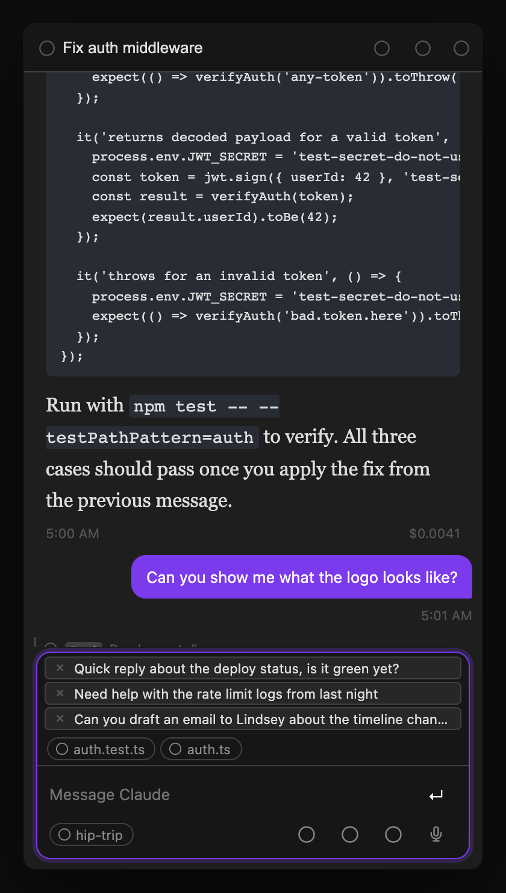
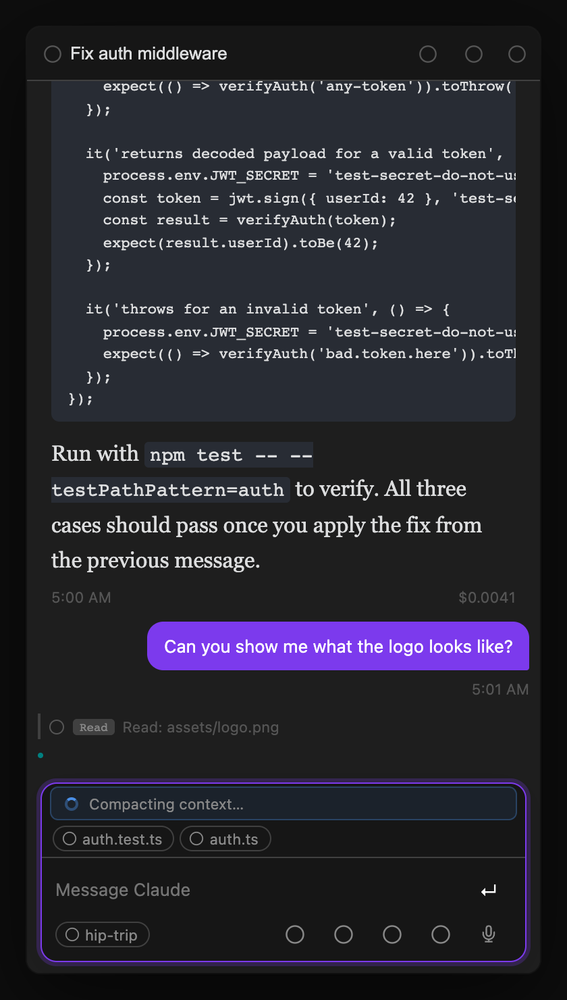
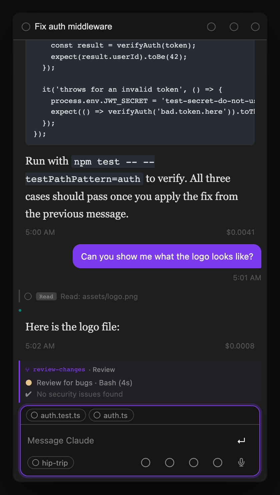
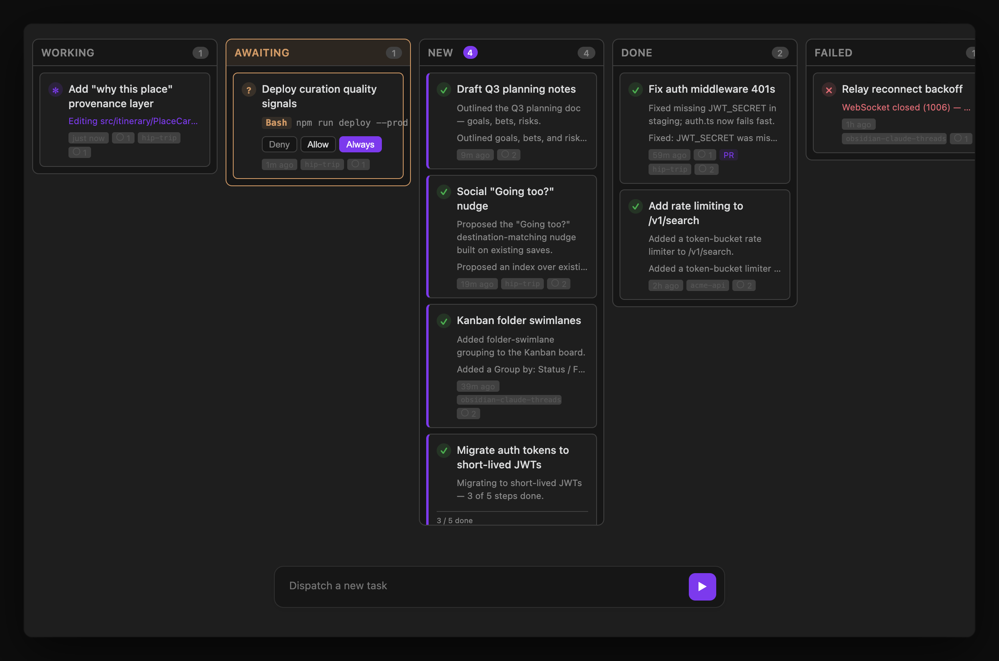
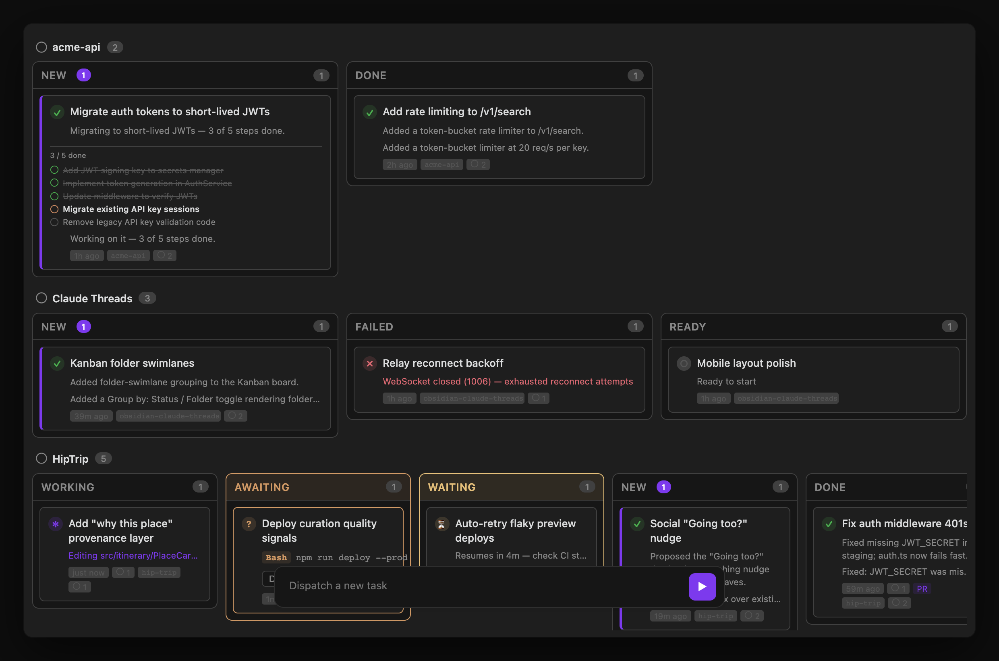
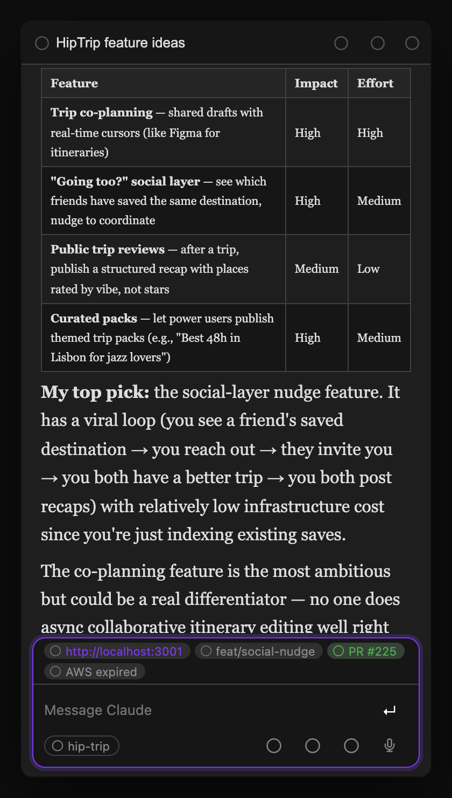

# Claude Threads for Obsidian

A native Obsidian sidebar plugin for running multiple Claude Code sessions in parallel — with streaming markdown responses, tab management, and deep vault integration.

  [](https://compass.rbcodelabs.com/portal/rbcodelabs/claude-threads/roadmap)

<p align="center">
  
</p>

<p align="center">
  
</p>

<p align="center">
  
</p>

<p align="center">
  
</p>

## What it does

Claude Threads embeds Claude Code directly in your Obsidian sidebar. Each tab is an independent Claude Code session with its own working directory and conversation history. You can run multiple sessions in parallel — one debugging a bug, another drafting docs, another answering questions about your vault.

**Key features:**

- **Multi-tab sessions** — open as many Claude threads as you need, switch between them instantly
- **Streaming responses** — tokens stream in with live markdown rendering (code blocks, tables, lists, etc.)
- **Persistent conversations** — sessions resume where you left off after restarting Obsidian
- **Auto-naming** — tabs rename themselves based on what you're working on (powered by the summarizer)
- **Thread summaries** — a header bar shows what each thread is about, auto-updated after each response
- **Agent dashboard** — monitor and dispatch to multiple threads from a single view; attach images or files to dispatched tasks via the paperclip button or drag-and-drop; resolve pending permission requests directly from dashboard rows without switching threads; toggle between list view and **kanban board** to visualize agent state by column (idle, running, waiting, done), or group the board into **folder swimlanes** — one lane per app/project — to see every conversation for a codebase together; the Kanban has its own floating dispatch panel so you can launch new tasks without leaving the board view
- **Compressed conversation view** — toggle "Compress view" from the ⋯ menu to collapse an agentic thread's history into one-line summaries per exchange. Consecutive assistant turns (a full agentic run between two user messages) are grouped into a single summary entry. Click the expand arrow on any entry to read the full response. Summaries are generated lazily in a serial background queue so the UI never spawns multiple Claude processes at once
- **Focus edited files** — one click closes all other tabs and opens only the files Claude touched in this thread, snapping your workspace to the work
- **Workspace tab syncing** — the Obsidian workspace tab title automatically reflects the active thread so you always know which session is which
- **Slash commands** — built-in context commands plus your full `~/.claude/skills/` library, browseable with `/`
- **Model switching** — set a persistent model per thread with `/model fable|opus|sonnet|haiku`, or a global default in settings
- **Claude or Bedrock** — authenticate with your Claude account or route every session through Amazon Bedrock (one dropdown in settings)
- **Goals and loops** — pin a persistent goal on a thread with `/goal`, or re-run a prompt on an interval with `/loop 10m <prompt>`
- **Task list card** — Claude Code's task checklist (TodoWrite / TaskCreate) renders live above the input box: completed tasks struck through, the in-progress one highlighted, with done/in-progress/open counts
- **Context compaction** — auto and manual compaction shown as persistent dividers in the conversation
- **Permission dialogs** — Claude asks before writing files or running commands; you approve or deny inline
- **@ file mentions** — type `@` in the input to search vault files by name; selecting one injects its full content into the prompt as context; type `@this` to reference the currently open file without searching
- **Push-to-talk voice input** — hold a configurable hotkey to dictate a message via speech-to-text (uses the Claude Code STT pipeline); transcript populates the input box ready to send or edit
- **Projects** — group threads by vault sub-folder with a shared context prompt injected into every message
- **Draft persistence** — input text and attachments auto-save when switching threads and survive plugin reloads
- **First-run onboarding** — on first install, a welcome guide walks you through setup and opens a three-panel workspace (conversation, Agent Dashboard, and an example thread) so the layout makes sense before you write a single message
- **Context recap banner** — when you return to a thread you haven't viewed in over a minute, a floating banner shows the thread summary and how long ago you were last active; auto-dismisses after 10 seconds
- **Keep computer awake** — prevents the Mac from sleeping while Claude is active; shows a ☕ indicator in the status bar (uses `caffeinate -i` on macOS, Web Lock API as fallback)
- **Plan Mode** — set permission mode to `plan` and Claude will propose a written plan before touching any files. An inline card lets you **Approve**, **Edit**, or **Reject** the plan before Claude proceeds
- **Thinking mode** — enable extended thinking for harder problems, with a configurable token budget for how long Claude reasons before responding
- **Effort level** — set `low`, `medium`, `high`, or the CLI default; controls how much work Claude invests per turn, useful for simple questions vs. deep research
- **MCP Elicitation** — when an MCP server needs OAuth or a form filled mid-session, a card appears inline in the conversation (URL auth or structured form fields) so you can respond without leaving Obsidian
- **Tool call visibility** — see exactly which files Claude is reading/writing during each response; tool pills show elapsed time once complete, REPL calls get a dedicated icon and summary, and git operations render as structured pills; files Claude edited that you subsequently modified show a "Modified by user" badge
- **Cancel and restore** — press Escape (or click Stop) while Claude is running to cancel; the sent message pops back into the input box ready to edit and re-send
- **Keyboard shortcuts** — navigate tabs without touching the mouse

## Prerequisites

- [Obsidian](https://obsidian.md) v1.0.0 or later (desktop only)
- [Claude Code CLI](https://docs.anthropic.com/en/docs/claude-code) installed and authenticated
  - The plugin auto-detects `claude` at `/opt/homebrew/bin/claude`, `/usr/local/bin/claude`, or `~/.local/bin/claude`
  - AWS Bedrock / SSO users: set `AWS_PROFILE` and `AWS_REGION` in the plugin's Extra Environment Variables setting

## Roadmap

Vote on upcoming features and see what's in progress at the [public roadmap](https://compass.rbcodelabs.com/portal/rbcodelabs/claude-threads/roadmap).

## Installation

### Via BRAT (recommended for early access)

1. Install the [BRAT plugin](https://github.com/TfTHacker/obsidian42-brat) from Obsidian's Community Plugins
2. Open BRAT settings → **Add Beta Plugin**
3. Enter: `rbcodelabs/obsidian-claude-threads`
4. Enable **Claude Threads** in Settings → Community Plugins

### Manual install

1. Download the latest release from [GitHub Releases](https://github.com/rbcodelabs/obsidian-claude-threads/releases)
2. Extract into your vault's plugin folder: `<vault>/.obsidian/plugins/claude-threads/`
3. Enable **Claude Threads** in Settings → Community Plugins

## Usage

Click the **message-square** icon in the left ribbon, or run **Open Claude Threads** from the command palette.

### Tabs

| Action | How |
|---|---|
| New thread | Click `+` in the tab bar |
| Close thread | Hover a tab → click `×` |
| Rename thread | Double-click the tab label |
| Switch to tab N | `Cmd+1` through `Cmd+9` |
| Next / previous tab | `Cmd+]` / `Cmd+[` |

Tabs are renamed automatically after the first exchange using the thread summarizer — no need to name them yourself.

### Sending messages

- **Enter** — send message
- **Shift+Enter** — newline
- **`/`** — opens slash command autocomplete
- **Escape** — cancel the running session; the sent message is restored to the input box so you can edit and re-send

**Collapsible input panels.** All three message-input panels (Threads view, Agent Dashboard sidebar, and Kanban dispatch) collapse to a minimal bar at rest — just the textarea and send button. Hover over the panel or click into the textarea to expand secondary controls (attach, mic, model picker, more menu, CWD chip) with a smooth animation. The panel border softens when collapsed so it reads as a quiet background element.

**Message queue.** If you send a message while Claude is already processing, it goes into a queue — displayed as stacked removable rows above the composer. Each row shows a preview of the queued message and an `×` button to discard it. Click any row to pull it back into the input box for editing (an inline confirm prompt prevents you from accidentally discarding your current draft). The queue drains automatically as Claude finishes each turn. Queued messages survive thread switches and plugin reloads.

<p align="center">
  
</p>

**Activity indicator.** While Claude is processing, a typed status card appears above the input area showing what's happening:

- **Active work** — a pulsing spinner with a short label (e.g. "Compacting context…" during automatic compaction, "Retrying API call…" on transient errors). The card disappears as soon as the operation completes.
- **Rate limit** — if the API returns a rate limit response, a card shows in warning or error style depending on whether the request was allowed to proceed or rejected outright.
- **Model escalation tip** — when a turn is routed to the escalation model (e.g. Fable 5 when you send `/escalate`), a brief tooltip pops up from the model button rather than reshuffling the layout. It fades in, holds for a moment, then fades out automatically — no interaction needed and zero layout shift. For the rest of the escalated turn, the model button itself stays highlighted with an accent glow, and its tooltip reads "escalated to \<model\> for this turn", so you can confirm the escalation at any point until the turn completes.

<p align="center">
  
</p>

### Slash commands

Type `/` in the input box to see built-in context commands and your installed Claude Code skills. Navigate with arrow keys, Tab, or Enter.

**Built-in commands** (handled by the plugin):

| Command | What it does |
|---|---|
| `/model fable\|opus\|sonnet\|haiku` | Set a persistent model for this thread |
| `/model default` | Reset thread model back to the global default |
| `/model` | Show the current model for this thread |
| `/goal <text>` | Set a persistent goal for this thread — injected into every turn until cleared |
| `/goal clear` | Clear the thread's goal (`/goal` alone shows the current goal) |
| `/loop <interval> <prompt>` | Send a prompt now and re-run it on an interval (e.g. `/loop 10m check CI`); replaces any loop already running on this thread |
| `/loop stop` | Stop the thread's loop (`/loop` alone shows it) |
| `/compact` | Summarize conversation history to free up context window |
| `/clear` | Clear conversation history and start a fresh session |
| `/cost` | Show token usage and cost for the current session |
| `/context` | Show a per-category token usage breakdown for the active session (tools, system prompt, skills, MCP tools, conversation, etc.) |
| `/create-pr` | Ask Claude to push the branch and open a PR (`gh pr create`) — same action as the [git diff bar](#git-diff-bar-create-pr)'s Create PR button |
| `/create-pr --draft` | Same, but opens a draft PR — same as the git diff bar's Create draft PR button |

**Command pills** — when you complete a built-in command (type `/goal ` or pick one from the dropdown), it turns into a pill chip at the left of the input box. Type the arguments after it; a single Backspace at the start of the input (or clicking the pill's ×) deletes the whole command. After a command, argument autocomplete kicks in — `/model ` offers `fable|opus|sonnet|haiku|default`.

**Skills** — any `.md` file (or directory) in `~/.claude/skills/` appears below the built-in commands. Selecting one inserts the skill name into your message, which Claude handles via your `CLAUDE.md` configuration.

### Skills Manager

Open the **Skills Manager** panel from the ribbon (puzzle icon) or command palette to browse, install, and edit Claude Code skills. The list and detail panels are split by a **draggable divider** — drag it to resize, double-click to reset to the default width; your chosen width is remembered next time you open the panel.

<p align="center">
  
</p>

**Installed tab** — shows everything installed as a collapsible source tree. A **Check for updates** button in the toolbar re-fetches staleness for all GitHub plugin sources in parallel; its icon spins while running, and a toast reports the result when it finishes (including which sources failed to check, e.g. if you're offline). An indicator dot appears on the button afterward if any plugin has updates (hover the button for the full status and last-checked time). GitHub plugin sources appear as top-level nodes with a badge (`•N`) when updates are available; clicking one expands it to reveal its skills and opens a detail panel with **Update** (git pull, highlighted when updates are available), **Reload** (re-scan from disk), **Reinstall** (delete and re-clone for broken installs), and **Remove Source**. A **Local** node at the bottom groups your standalone skills and agents — click any item to view and edit it. For skills: **Save**, **Reload**, **Reveal in Finder**, **Uninstall**. For agents: **Save**, **Reload**, **Reveal in Finder**, **Delete**. The **Import…** button opens a menu with **Folder…** and **File (.skill)…**, letting you install a skill directly from a local folder or a packaged `.skill`/`.zip` archive, without going through GitHub.

**Browse tab** — search the [skills.sh](https://skills.sh) registry. Results show the skill name, GitHub source, and install count. Click a result to see details and an **Install** button that clones the skill from GitHub into `~/.claude/skills/`.

### @ file mentions

Type `@` anywhere in the input box to search vault files by name. A dropdown appears showing up to 20 matching files — navigate with arrow keys and press Tab or Enter to insert.

<p align="center">
  
</p>

Selecting a file inserts `@[[filename]]` into your message. When you send the message, the plugin resolves each mention and appends the file's full content as context for Claude — useful for asking Claude to work with a specific note, doc, or config file without copying and pasting.

Type `@this` (no search needed) to instantly reference the currently active file in Obsidian. It resolves to the same `@[[filename]]` injection at send time.

### Model switching

`/model` sets the model for all subsequent turns in a thread:

```
/model fable    → uses Claude Fable 5 for every turn in this thread
/model opus     → uses Claude Opus for every turn in this thread
/model sonnet   → switches to Sonnet
/model haiku    → switches to Haiku
/model default  → resets to the plugin's Default model setting (or the CLI default)
```

A **Default model** dropdown in settings picks the model for threads that have no `/model` override. Family aliases (Fable / Opus / Sonnet / Haiku "latest") are always listed first; pinned model IDs are sourced from the SDK's `capabilities_discovered` event, which fires the first time a thread starts in the current Obsidian session. Before any thread has run, the dropdown falls back to a hardcoded list of current models — start a thread and reopen Settings to see the full CLI-sourced list, so no plugin update is needed when Anthropic adds a new model. The Escalation model dropdown is populated the same way.

You can also switch models without typing: a **model switcher button** (CPU icon) sits in the conversation footer, left of the menu button. Hover it to see the active model; click it to pick Default / Opus / Sonnet / Haiku / Fable from a dropdown. The icon turns accent-colored whenever a per-thread override is active, and it stays in sync with the `/model` command.

The active model is shown as a badge in the thread info bar. You can also use `/escalate` as a one-turn override — it routes just that message to the Escalation model chosen in settings (Fable 5, Opus, Sonnet, or Haiku), then the thread model resumes. Both the keyword and the target model are configurable. While an escalated turn is running, the model switcher button glows in the accent color and its tooltip names the escalated model, so you always have visible confirmation that the escalation took effect. The glow clears automatically when the turn finishes.

### Goals and loops

**Goals** — `/goal <text>` pins a persistent goal on a thread. Setting a goal does two things:

1. Claude immediately starts working toward it — no separate prompt needed.
2. The goal is injected into the system prompt on **every subsequent turn**, so it survives context compaction, topic drift, and multi-day threads. Claude is instructed to keep working toward it until it's met or blocked on your input.

`/goal` alone shows the current goal; `/goal clear` (or `off`/`done`) removes it.

**Loops** — `/loop <interval> <prompt>` re-sends a prompt to the thread on a schedule:

```
/loop 30s poll the deploy status     → every 30 seconds
/loop 5m check the build             → every 5 minutes
/loop 1h summarize new emails        → every hour
/loop 10 check CI                    → bare numbers mean minutes
```

Like `/goal`, starting a loop sends the prompt immediately — you don't wait for the
first interval to elapse. Intervals below 30 seconds are clamped to 30s. Loops run on
the plugin's built-in scheduler, so they **persist across plugin reloads and Obsidian
restarts**. If a loop tick arrives before the thread's previous turn has finished, it's
retried shortly after rather than piling up as a queued duplicate. A thread can only
have one active loop at a time — starting a new `/loop` replaces whichever loop was
already running there. `/loop` alone lists the thread's loop with its next run time;
`/loop stop` (or `off`/`cancel`/`clear`) stops it. While a loop is active, a banner
above the input shows its status ("Loop running…" or the next run time) with a **Stop**
button, and a matching pill appears in the thread's status footer.

### Dispatching with commands

`/model`, `/goal`, and `/loop` also work as prefixes in the dashboard and kanban dispatch boxes, applying to the newly created thread:

- `/model opus fix the login bug` — creates the new thread with Opus set as its model and dispatches just the prompt
- `/goal ship the v1 login flow` — creates the thread with that persistent goal and immediately starts working toward it (same kickoff as `/goal` inside a thread)
- `/loop 10m check CI status` — creates the thread, sends the prompt now, and re-runs it every 10 minutes (stop it later with `/loop stop` inside the thread)

A command with bad or missing arguments shows a notice and keeps your draft instead of creating a thread. The thread-management variants (`/goal clear`, `/loop stop`) only work inside an existing thread.

### Context compaction

When the context window fills up, Claude compacts the conversation automatically. You can also trigger it manually with `/compact`. Either way, a divider appears in the conversation showing when compaction happened and how many tokens were in context beforehand. Compaction markers are persisted and survive plugin reloads.

### Agent dashboard

Open the **Agent Dashboard** from the ribbon or command palette to see all threads at a glance. Each thread appears as a row showing its name, working directory, current model, and status.

**Live activity (running threads):** While a thread is actively processing, the dashboard shows a live one-line summary of the current tool call or step — so you can see "Reading src/components/Header.tsx" or "Running npm test" without switching to that tab.

**Auto-generated summaries (idle threads):** After each completed response, the summarizer runs in a lightweight background process (a separate Claude Code instance using a small model) and writes a multi-sentence recap of what that thread worked on. This summary is shown in the dashboard row so you can re-orient yourself to any thread at a glance — what it accomplished, what files it touched, what's left to do.

This combination means you can dispatch several threads in parallel, switch to other work, then return to the dashboard to understand the state of every agent without reading through each conversation.

You can also send messages to any thread directly from the dashboard without switching tabs.

### Inline workflow progress

When a thread runs the `Workflow` tool (multi-agent orchestration), a live progress block appears inline in the conversation — pinned above the streaming output — showing:

- **Workflow name** and **current phase** (updates as the workflow transitions between phases)
- **Per-agent rows** — each spawned sub-agent gets a row with a dot (pulsing while running, filled when done, ✗ on failure) and its task description. Rows appear as agents are launched and update in place as they complete; they don't disappear, so you can see the full run at a glance even before the workflow finishes.
- **Done / Failed badge** — when the workflow completes, the block locks into a final state with a "Done" or "Failed" annotation.

<p align="center">
  
</p>

The block is rendered entirely from the SDK event stream (no extra API calls), so it appears immediately when the first sub-agent starts and has zero overhead for threads that don't use workflows.

### Kanban board

Toggle the **Kanban** button in the dashboard toolbar to switch from the default list view to a board layout. Each thread is a card, bucketed into a column for its agent state: **Working**, **Awaiting** (permission), **New** (unreviewed), **Done**, **Failed**, and **Ready** (empty). Columns are sorted most-recently-active first. The board has its own floating dispatch panel at the bottom — type a task and press Enter to launch a new thread without leaving it. List view is the default; the preference persists across reloads.

**Task list on cards.** When a thread has an active `TodoWrite` / `TaskCreate` checklist, its kanban card shows a compact task list: up to 5 items with status icons (✔ completed, ■ in-progress, ○ pending), a "X / Y done" progress line, and "+N more" when there are additional tasks. The list updates live as the agent ticks items off.

<p align="center">
  
</p>

**Auto-collapse side panels.** Set **Settings → Features → Kanban board → Auto-collapse side panel** to `Left sidebar`, `Right sidebar`, or `Both sidebars` to automatically collapse Obsidian's sidebar panel(s) when the Kanban tab opens, giving the board more horizontal room. Only the panel(s) the Kanban view collapsed are restored when you close the tab, so it won't fight a panel you collapsed or expanded manually. Defaults to `None` (opt-in).

**Group by folder.** Use the group-by toggle in the board header (the columns/folder icon, next to search) to switch from status columns to **folder swimlanes** — one horizontal lane per app/project, so you can see every conversation for a given codebase together. Each lane is keyed by the thread's assigned **Project**, falling back to a working-directory label (git repo name) when no project is set, and an **Unassigned** lane catches threads with no folder. Inside each lane the cards are still grouped into the same status columns (empty columns are hidden to keep lanes compact). Lanes are ordered by most-recent activity, with Unassigned pinned last. The choice persists across reloads.

<p align="center">
  
</p>

### Push-to-talk voice input

Hold the configured push-to-talk key (default: none — set it in Settings → Push to Talk Hotkey) and speak. The microphone activates while you hold the key; releasing it stops recording and transcribes your speech using the Claude Code STT pipeline. The transcript populates the input box so you can review and edit before sending. The floating input panel highlights while recording so you always know the mic is live.

### Permissions

When Claude needs to write a file or run a command, a permission card appears inline in the conversation asking you to **Allow**, **Deny**, or **Always Allow**. Always Allow adds the tool to a per-vault allowlist so you're never asked again for that tool. You can also resolve permissions directly from the Agent Dashboard without switching threads. The default behavior can be changed globally in **Settings → Tools → Permission Mode**, or **per-thread** via the shield (🛡) button in the thread footer — a thread-level override takes precedence over the global setting and is useful when you want plan mode for one specific task without affecting other threads:

| Mode | Behavior |
|---|---|
| `default` | Use the Claude CLI default (prompts for most tool calls) |
| `acceptEdits` | Automatically accept file edits; prompt for commands and other tools |
| `bypassPermissions` | Skip all permission prompts — Claude executes everything without asking |
| `plan` | Claude proposes a written plan before taking any action; you approve, edit, or reject it before it proceeds (see [Plan Mode](#plan-mode) below) |
| `dontAsk` | Suppress all interactive permission dialogs; Claude proceeds without confirmation. Intended for scheduled/background sessions that run unattended |
| `auto` | Claude autonomously decides when to prompt vs. proceed based on action risk |

> **Note for scheduled sessions:** threads created by the built-in scheduler automatically use `dontAsk` so cron jobs never stall waiting for a permission dialog that nobody is watching. They also inherit any external MCP servers defined in `~/.claude/settings.json` (Compass, Helio, or any other user-configured HTTP/SSE/stdio server) alongside the plugin's built-in tools, so scheduled agents have the same tool surface as an interactive CLI session — `${VAR_NAME}` placeholders in that config are resolved from environment variables and keychain-stored secrets.

### Plan Mode

Set **Permission Mode → `plan`** globally in settings, or use the **shield button** in the thread footer to set it for a single thread, to enable Plan Mode. In this mode Claude reads, researches, and thinks — but doesn't write files or run commands — until it has produced a written plan and you've approved it.

**The flow:**

1. You send a message as normal.
2. A **"Planning…"** visual state appears in the thread while Claude gathers context.
3. When Claude finishes its plan, an inline card replaces the spinner, showing the full proposed plan text.
4. You pick one of three actions on the card:
   - **Approve** — Claude proceeds to execute the plan immediately.
   - **Edit** — The plan text becomes editable in-place; submitting the edited version sends it back to Claude as the confirmed plan before execution.
   - **Reject** — Claude stops; no edits are made. You can send a follow-up message to redirect.

Plan Mode is useful for risky or large-scale tasks where you want to review the approach before any files are touched.

### MCP Elicitation

Some MCP servers need a credential or a form filled before they can proceed — for example, an OAuth flow or a confirmation dialog. When this happens, Claude Threads renders an elicitation card inline in the conversation rather than silently failing.

- **URL auth card** — displays a clickable link for the OAuth URL. Click it to open the auth page in Obsidian's Web Viewer (or your system browser), complete the flow, then return to the thread. Claude resumes automatically once the server receives the credential.
- **Form card** — renders input fields derived from the server's JSON schema (text fields, selects, checkboxes). Fill in the form and submit; the response is forwarded to the MCP server and the session continues.

Without elicitation support the session would stall indefinitely with no visible feedback. The card makes the situation visible and actionable without leaving Obsidian.

### Remote access (mobile)

Claude Threads can mirror your desktop sessions to Obsidian Mobile in real time. Your phone becomes a thin client: you can read the conversation as it streams, send messages, approve permission requests, and switch between threads — all over a secure WebSocket relay. The desktop does all the actual Claude work; mobile just shows the state.

**Prerequisites:**

- Obsidian desktop with Claude Threads installed and running
- Obsidian Mobile with Claude Threads installed via [BRAT](https://github.com/TfTHacker/obsidian42-brat)
- Both devices on any internet connection (no LAN required)

**Setup:**

1. On desktop: open Settings > Claude Threads > Remote Access and toggle **Enable remote access** on
2. Click **Show pairing QR code** — a QR code appears with a 5-minute expiry window
3. On mobile: open the Claude Threads ribbon icon, tap **Connect to Desktop**, then scan the QR code (or tap the `claude-threads://pair` link if you're on the same device)
4. The mobile view refreshes to show all your desktop threads

**Manual pairing (URI scheme):**

If you can't scan a QR code, send yourself the pairing link directly:

```
claude-threads://pair?roomId=<ROOM_ID>&relay=<RELAY_URL>
```

Opening this URL on any device with Obsidian Mobile + Claude Threads installed will pair it to your desktop.

**What you can do on mobile:**

- Read streaming conversation output and tool calls in real time
- Send messages, approve or deny permission requests (including **Always Allow**)
- Switch between threads and search the thread list by title or summary
- See each thread's **status rail** — spinner cards for active tool calls, error cards for failed threads
- Copy any assistant message to clipboard with the ⎘ button
- View the thread's **cwd chip**, **model**, and **message timestamps**
- See **queue rows** for pending messages (tap to pull back into the composer, × to cancel)
- View **tool pill icons** matching the desktop view

**Limitations:**

- Desktop must be running and connected — mobile cannot start new Claude sessions without desktop
- Mobile is a read-mostly thin client; it cannot access your vault files or run tools directly
- One desktop per room ID; rotate the room ID in settings to revoke all mobile access

<p align="center">
  
</p>

### Compressed conversation view

Long agentic threads — especially ones with many tool calls spread across dozens of turns — can be hard to scan. Toggle **Compress view** from the `⋯` menu (top-right of the conversation panel) to collapse the history into a scannable list of one-line summaries.

**How it works:**

- Each entry represents one *exchange*: a user message followed by all the consecutive assistant turns that came back before the next user message (i.e., a full agentic run)
- The summary for each entry is generated by running the combined content of all assistant turns through a lightweight background process — so you get one meaningful summary ("Investigated codebase, added 4 MCP tools, wrote tests") rather than N fragments
- Summaries are generated lazily in a serial queue (one at a time) so toggling compress view on a 50-message thread won't spawn 50 simultaneous Claude processes
- Click the **⌄** arrow on any entry to expand it and read the full response with all tool calls intact
- Toggle the menu item again (now labelled **Expand view**) to return to the normal conversation view

Summaries are cached in memory for the session. They regenerate on the next reload — which keeps storage simple while keeping the background work cheap (the in-process model is fast and inexpensive).

### Thread summaries

A summary bar above the messages shows what the thread is about. It updates automatically after each response if **Auto-summarize** is enabled, or you can trigger it manually with the brain icon. The summarizer updates the tab name — auto-summarize only does this when the name is still the default "Thread N"; manual summarize always applies the new title regardless of what the tab is currently named.

When you switch back to a thread you haven't viewed in over a minute, a **context recap banner** floats at the top of the conversation showing the thread summary and how long ago you were last active. It auto-dismisses after 10 seconds or when you send a message.

<p align="center">
  
</p>

### Projects

Projects group threads by vault sub-folder and inject shared context into every message, so Claude always knows what it's working on.

**Creating a project:** Go to Settings → Projects → enter a project name and vault folder path → click **Create project**. You can also add a project context prompt — a few sentences describing the project's goals, conventions, and key files that Claude should always keep in mind.

**Opening a thread in a project:** When you create a new thread, select a project from the dropdown near the input box. The thread's working directory is set to the project's vault folder, and the project context is prepended to every message you send.

**Managing projects:** Edit the name, folder, or context prompt at any time in Settings → Projects. Deleting a project keeps all its threads — they just lose the project association.

### Status line (context footer)

A row of pills below the input area shows live context for each thread — git branch, an open PR, a running dev server URL, AWS session status, or anything else you want. It's powered by a shell command (Settings → **Context footer command**) that the plugin runs **per thread, in the background**, against that thread's working directory. Desktop only.

<p align="center">
  
</p>

**Output format.** The command can return either:

- **A JSON array of tags** (recommended) — each pill is a `StatusTag`:

  ```json
  [
    { "label": "http://localhost:3001", "url": "http://localhost:3001", "kind": "dev" },
    { "label": "feat/social-nudge", "kind": "branch" },
    { "label": "PR #225", "url": "https://github.com/acme/app/pull/225", "kind": "pr" },
    { "label": "AWS expired", "tone": "warn", "kind": "aws" }
  ]
  ```

  | Field | Meaning |
  |---|---|
  | `label` | **Required.** Pill text. |
  | `url` | Makes the pill a clickable link (opens in your browser). |
  | `icon` | [Lucide](https://lucide.dev) icon name. Defaults from `kind` if omitted. |
  | `tone` | `normal` (default), `warn`, or `error` — colors the pill. |
  | `kind` | `pr`, `branch`, `dev`, `aws`, or any custom string. A `kind:"pr"` tag (or any `url` ending in `/pull/N`) becomes the thread's PR — shown as the PR pill and surfaced to the Kanban board, MCP tools, and release automation. |

- **Plaintext** (the Claude Code statusline convention) — segments split on 2+ spaces, with heuristic icons (URL→globe, `PR #N`→pull-request, `AWS …`→cloud, else→branch). Existing scripts keep working unchanged.

**Input.** The command receives JSON on stdin: `{ "cwd": "…", "workspace": { "current_dir": "…" }, "provider": "claude" | "bedrock" }`. Use `provider` to gate provider-specific pills — e.g. only emit an AWS pill when `provider == "bedrock"` so a logged-out AWS session doesn't show a spurious warning on a non-Bedrock machine.

**PR detection** is fully script-driven: a `kind:"pr"` tag with a `url` (e.g. from `gh pr view`) populates the thread's `prUrl`, which is **sticky** — it survives after the PR merges so release tooling can still match the thread.

**Opening links:** clicking a pill with a `url` opens it in Obsidian's in-app **Web Viewer** when that core plugin is enabled (reusing an existing tab); otherwise it opens in your system browser. **Cmd-click** (Ctrl-click on Windows/Linux) always opens in the system browser, even when the Web Viewer is enabled.

A ready-to-use reference script (branch · PR · dev URL · Bedrock-gated AWS) ships at [`docs/statusline-command.example.sh`](docs/statusline-command.example.sh).

### Git diff bar (Create PR)

Whenever a thread's working directory is a git repo on a feature branch, a bar appears just above the compose box showing the branch name and a live diff stat (`+60 -4`) — the total change between the branch's base (e.g. `main`) and the current working tree, including any uncommitted changes. Unlike the status-line pills above, this needs no configuration: it's computed natively from local `git` commands only (no `gh`, no network), and is desktop only, mirroring the status line's mobile no-op.

A **Create PR** split button sits on the right:

- **Create PR** — sends `/create-pr`, which asks Claude to push the branch if needed, run `gh pr create` with a title/description summarizing the session, and report back the PR URL.
- **Create draft PR** (dropdown) — same, but `gh pr create --draft`. Also available directly as `/create-pr --draft`.
- **Manually create PR** (dropdown) — skips Claude entirely and opens GitHub's compare page (`/compare/<base>...<branch>`) in your browser (Web Viewer or system browser, same convention as status-line pill links), so you can review the diff and open the PR yourself. Only enabled when the repo's `origin` remote points at GitHub.

The bar is hidden when the cwd isn't a git repo, when the branch can't be resolved (e.g. detached HEAD), or when you're already sitting on the base/default branch (nothing to open a PR against).

### Safe plugin reload

Use **Claude Threads: Reload plugin (safe)** from the command palette instead of Obsidian's built-in "Reload plugin" button. When no threads are running it reloads immediately. When threads are active it opens a modal showing their names with three choices: **Cancel** (keep working), **Interrupt & Reload** (sends an interrupt signal and waits up to 30 seconds for a clean shutdown), or **Force Reload** (kills sessions immediately). Reloading via any other path (Settings toggle, manifest hot-reload) triggers a graceful 10-second interrupt wait automatically before teardown.

## Agent tools reference

Every Claude thread runs with a built-in MCP server that exposes tools for vault access, session control, and — for multi-agent workflows — live coordination with other threads. These tools are available automatically; no configuration is required.

### Vault tools

Read and search your Obsidian vault from within any thread.

| Tool | Parameters | Description |
|---|---|---|
| `obsidian_search_vault` | `query`, `limit?` | Full-text search across all Markdown files. Tokenizes multi-word queries so each term is matched independently. Returns results ranked by relevance (filename hits weighted 10×) with a ~300-char excerpt from the densest matching region. Default limit: 20. |
| `obsidian_get_note_metadata` | `path` | Returns the full metadata cache entry for a note: frontmatter, tags, wikilinks, and headings. |
| `obsidian_get_backlinks` | `path` | Returns all notes that link to the specified file, with source path and original link text. |
| `obsidian_get_outgoing_links` | `path` | Returns all wikilinks and Markdown links a note makes to other files, with display text and resolved vault paths. |

### UI tools

Interact with the active Obsidian workspace.

| Tool | Parameters | Description |
|---|---|---|
| `obsidian_get_active_file` | — | Returns metadata (path, basename, extension, size, mtime, ctime) for the file currently open in the editor, or `null` if nothing is open. |
| `obsidian_get_open_tabs` | — | Returns all open tabs with path, title, view type, and which one is active. |
| `obsidian_navigate_to_file` | `path`, `newLeaf?` | Opens a vault file in the editor. Pass `newLeaf: true` to open in a new tab. |
| `obsidian_insert_at_cursor` | `text` | Inserts text at the cursor in the active editor, replacing any current selection. |
| `obsidian_list_commands` | `query?` | Returns all registered Obsidian commands (id + name), sorted alphabetically. Pass a `query` string to filter. Use this to discover command IDs before calling `obsidian_execute_command`. |
| `obsidian_execute_command` | `commandId` | Runs any Obsidian command by its ID (e.g. `obsidian-git:push`, `editor:toggle-bold`). Returns success or failure. |

### Session tools

Control the current thread's session state.

| Tool | Parameters | Description |
|---|---|---|
| `set_working_directory` | `path` | Changes the working directory for this session. Accepts an absolute path; `~` is expanded. Takes effect on the next turn. |
| `ScheduleWakeup` | `delaySeconds`, `prompt`, `reason` | Schedules a message to be injected into this thread after a delay. Useful for polling CI, waiting for a deploy, or self-pacing a loop. While the wake-up is pending the thread shows a waiting indicator — a "Waiting" group with a live countdown (`Resumes in 4m — <reason>`) in the Agent Dashboard, and a banner above the chat input — each with a one-click Cancel. |
| `EnterWorktree` | `branch?`, `baseBranch?`, `repoPath?` | Creates a git worktree for the current repo and switches the session cwd to it. Automatically routed to the plugin's MCP implementation, which tracks the in-session cwd correctly after `set_working_directory`. |
| `ExitWorktree` | `worktreePath?`, `force?` | Removes the worktree and restores the session cwd to the original repo root. Defaults to the current effective cwd. Pass `force: true` to remove even if there are uncommitted changes. |
| `fork_conversation` | `focus_area?` | Forks the current conversation into a new independent thread. A lightweight Claude call distills the history into a focused starting prompt. The current thread continues unaffected. |
| `request_secret` | `secretName`, `reason`, `force?` | Prompts the user (via a modal) to provide a secret value such as an API key. The value is stored in the OS keychain under the plugin's namespace and injected into future sessions as an environment variable — it never appears in the conversation. Returns `{success: true, secretName, alreadyExisted: boolean}` if the user saves, or `{success: false, reason}` if cancelled. If a secret with the same name already exists, returns `alreadyExisted: true` immediately without prompting. Pass `force: true` to always re-prompt (e.g. when rotating a stale token) — the modal will indicate that the existing value will be replaced. |

### Thread coordination tools

Discover, read, and message other running threads. These tools enable agent-to-agent delegation — one thread can assign work to another, wait for it to finish, and read the result.

| Tool | Parameters | Description |
|---|---|---|
| `obsidian_get_current_thread` | — | Returns this thread's own metadata: `id`, `title`, `status`, `isRunning`, `projectId`, `cwd`, `updatedAt`, `messageCount`. Useful for knowing your own context before coordinating with peers. |
| `obsidian_list_threads` | — | Returns all threads with the same metadata fields as `obsidian_get_current_thread`, including a live `isRunning` flag. |
| `obsidian_list_projects` | — | Returns all configured projects: `id`, `name`, `description`, `vaultFolder`. Useful for deciding which project context a new thread should use. |
| `obsidian_create_project` | `name`, `vaultFolder`, `description?`, `cwdOverride?` | Creates a new project and persists it. Returns the created project snapshot including its `id` — capture this for use with `CronCreate`, `obsidian_set_thread_project`, and other project-aware APIs. |
| `obsidian_set_thread_project` | `threadId`, `projectId` | Assigns a thread to a project. Pass `projectId: null` to detach the thread from its current project. Call `obsidian_list_projects` first to get a valid `projectId`. |
| `obsidian_get_thread_messages` | `threadId`, `limit?` | Returns the live message history for any thread. Messages are filtered to `user` and `assistant` roles (internal compaction markers are excluded). Default: last 20 messages. |
| `obsidian_wait_for_thread` | `threadId`, `timeoutSeconds?` | Blocks until the target thread finishes its current request (`isRunning` → `false`). Polls every second. Returns `{ done: true, elapsedSeconds }` on success, or `{ timedOut: true }` if the timeout is reached (default 120s, max 600s). Returns immediately if the thread is already idle. |
| `obsidian_send_message_to_thread` | `threadId`, `message` | Queues a user message on another thread and triggers Claude to process it. Returns immediately once the message is enqueued — use `obsidian_wait_for_thread` to block until the response is ready. Cannot send to the current thread. |
| `obsidian_archive_thread` | `threadId` | Saves the thread as a vault note (if vault save is enabled) then removes it from the active thread list. Use at the end of a release or multi-step session to close out completed threads automatically. A thread cannot archive itself. |
| `obsidian_open_url` | `url`, `newTab?` | Opens a URL in the Obsidian Web Viewer panel. Reuses an existing Web Viewer tab by default; set `newTab: true` to force a fresh tab. Useful for opening local dev servers (`http://localhost:…`), HTML prototypes, or any web page directly from an agent without manual URL entry. |

**`isRunning` vs `status`:** `status` is a persisted field (`waiting`, `active`, `error`, `archived`, `reconnecting`) that reflects the last known state. `isRunning` is a live flag that is `true` only while Claude is actively streaming a response. Use `isRunning` for coordination decisions; use `status` to filter out archived or errored threads. `reconnecting` is a transient state: the underlying `claude` CLI transport was force-closed mid-tool-call (a spurious "Stream closed" error, not necessarily a real failure), and the plugin is auto-firing one follow-up turn so Claude can verify whether the interrupted action actually succeeded before treating it as an error.

#### Coordination pattern

A typical delegation loop:

1. Call `obsidian_list_threads` to find a peer, or `fork_conversation` to create a dedicated one
2. Call `obsidian_send_message_to_thread` to assign a task
3. Call `obsidian_wait_for_thread` to block until the peer finishes
4. Call `obsidian_get_thread_messages` to read the result

```
Thread A                              Thread B
  │                                      │
  ├─ obsidian_list_threads               │
  ├─ obsidian_send_message_to_thread ───►│ (Claude receives message)
  ├─ obsidian_wait_for_thread            │
  │   (polls isRunning every 1s)         ├─ ... processes task ...
  │◄────────────────────────────────────┤ (isRunning → false)
  └─ obsidian_get_thread_messages        │
       (reads the result)
```

This pattern works across any combination of threads — you can fan out to multiple peers simultaneously by sending messages to several threads before waiting on any of them.

### Vault Bridges integration

If you have the [Vault Bridges](https://github.com/rbcodelabs/obsidian-vault-bridges) plugin installed, Claude agents can inspect and configure bridges directly via MCP — no config-file editing or Obsidian restarts required.

| Tool | Parameters | Description |
|---|---|---|
| `obsidian_list_vault_bridges` | — | Returns all currently configured bridges. Agents should call this first to check what already exists before adding a new one. |
| `obsidian_add_vault_bridge` | `name`, `repoPath`, `vaultPath`, `sourcePath?`, `branch?`, `autoSync?`, `syncNow?` | Adds a new bridge live via the Vault Bridges API. The bridge is registered immediately — the status bar updates, per-bridge push/pull commands are wired up, and settings are saved. If a bridge with the same `repoPath` + `vaultPath` already exists, the existing record is returned without creating a duplicate. |

Both tools return a clear error if the vault-bridges plugin is not installed or not enabled.

#### Bridge-aware edits

When an agent edits files inside a bridged repo (rather than the synced vault copy), Claude Threads detects it automatically at the end of the turn:

- **Auto-pull** — each affected bridge is synced once per turn, so the vault copies update immediately (a notice confirms success or failure).
- **Vault-relative links** — edited-file chips, the focus button, and absolute repo paths in Claude's messages all resolve to the synced vault note: chips show the vault path and open the note in Obsidian, and message paths become clickable internal links (only when the vault copy exists).

Edits made directly to vault files are unaffected — they don't match any bridge root and behave as before. Note that edits made inside a temporary coding-task worktree only reach the vault after merge plus a normal bridge pull.

## Settings

| Setting | Description |
|---|---|
| Claude binary path | Path to the `claude` executable (auto-detected) |
| Default working directory | `cwd` for new threads; defaults to vault root |
| Save threads to vault | Auto-save conversations as Markdown notes |
| Vault folder | Folder for saved thread notes (default: `Claude/`) |
| Extra environment variables | `KEY=VALUE` pairs injected into Claude's environment (useful for `AWS_PROFILE`, `AWS_REGION`) |
| Secret environment variables | Keychain-backed env vars (values stored in the OS keychain, never in `data.json`) — for API keys and tokens |
| Permission mode | How Claude handles tool-use confirmation. Options: `default` (CLI default), `acceptEdits` (auto-approve file edits), `bypassPermissions` (skip all prompts), `plan` (propose a plan first — see [Plan Mode](#plan-mode)), `dontAsk` (no dialogs; for unattended/scheduled sessions), `auto` (Claude decides). See [Permissions](#permissions). |
| Thinking mode | `disabled` (default), `enabled`, or `auto` — controls whether Claude uses extended thinking for harder problems |
| Thinking budget tokens | Maximum tokens Claude can spend on reasoning when thinking mode is `enabled` (default: 8 000). Only shown when thinking mode is `enabled` |
| Effort level | `default`, `low`, `medium`, or `high` — how much work Claude invests per turn. `default` uses the CLI setting |
| Agent progress summaries | Whether sub-agent progress is summarised and shown inline (default: on) |
| Enable 1M context (beta) | Opt-in to the 1-million-token context window beta (uses the `interleaved-thinking-2025-05-14` beta flag) |
| Ephemeral session | When on, sessions are not persisted to disk — they cannot be resumed after the thread closes |
| Layout density | `Comfortable`, `Compact`, or `Spacious` — controls message spacing and padding |
| Enable summarization | Show the summarize button and auto-summarize |
| Auto-summarize after response | Regenerate summary + tab name after each assistant turn |
| Claude summarization model | Model alias for summarization (e.g. `haiku`, `sonnet`) |
| Escalation keyword | Keyword that routes a single turn to the escalation model (default: `/escalate`) |
| Escalation model | Model the escalation keyword targets (default: Opus) |
| Keep computer awake | Prevent the Mac from sleeping while Claude is processing; shows ☕ in the status bar |
| Context footer command | Shell command that produces the status-line pills (JSON tags or plaintext). Run per-thread against its cwd; receives `{cwd, workspace, provider}` on stdin. Desktop only. See [Status line](#status-line-context-footer). |
| Projects | Group threads by vault sub-folder with a shared context prompt |
| Auto-collapse side panel | Collapse the left, right, or both sidebars when the Kanban board opens, restoring them when it closes (default: `None`). See [Kanban board](#kanban-board). |
| Remote access | Enable/disable mobile remote access via WebSocket relay |
| Room ID | Shared secret used to pair mobile (rotate to revoke all access) |
| Show pairing QR | Display a QR code for one-time mobile pairing (expires in 5 minutes) |

## Building from source

```bash
git clone https://github.com/rbcodelabs/obsidian-claude-threads
cd obsidian-claude-threads
npm install
npm run build
# Output is in dist/
```

## Releasing

The project uses a worktree-based workflow — edits directly to the main checkout are blocked by a git hook. Follow these steps:

1. **Create a worktree** for the version bump:
   ```bash
   git worktree add .claude/worktrees/chore/bump-version-X.Y.Z -b chore/bump-version-X.Y.Z
   cd .claude/worktrees/chore/bump-version-X.Y.Z
   ```

2. **Bump the version** in `manifest.json` and `package.json` (both must match), then commit and push:
   ```bash
   git add manifest.json package.json
   git commit -m "chore: bump version to vX.Y.Z"
   git push -u origin chore/bump-version-X.Y.Z
   ```

3. **Open and squash-merge a PR** for the version bump:
   ```bash
   gh pr create --title "chore: bump version to vX.Y.Z" --body "Version bump." --base main
   gh pr merge <number> --squash --delete-branch
   ```

4. **Pull main and push the tag** to trigger the release workflow:
   ```bash
   git pull origin main
   git tag vX.Y.Z
   git push origin vX.Y.Z
   ```

5. That's it. The [release workflow](.github/workflows/release.yml) automatically builds the plugin and publishes a GitHub release with `main.js`, `styles.css`, and `manifest.json` attached — BRAT will pick it up within a few minutes.

## License

MIT
