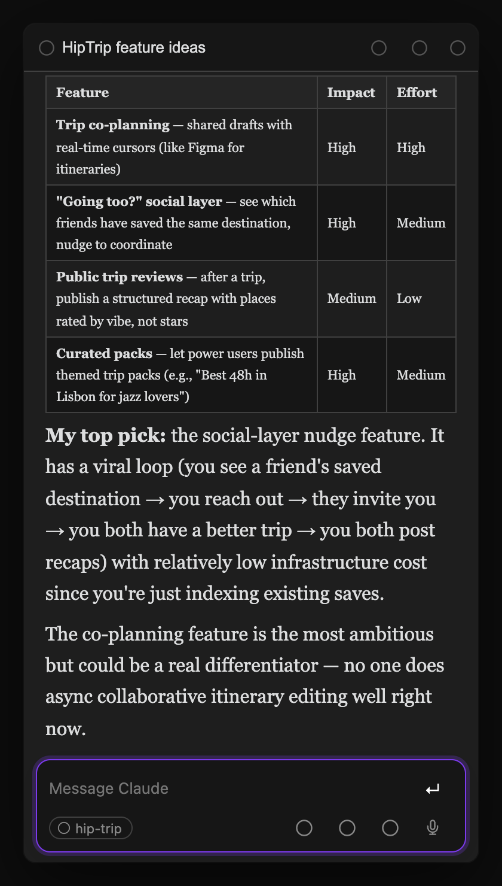
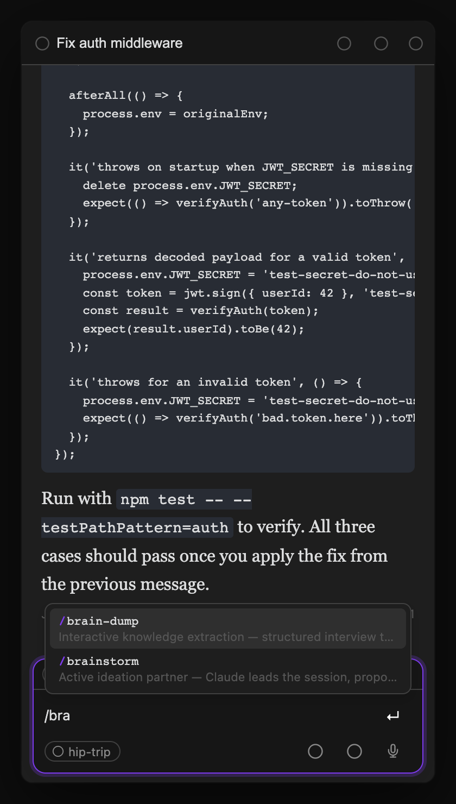
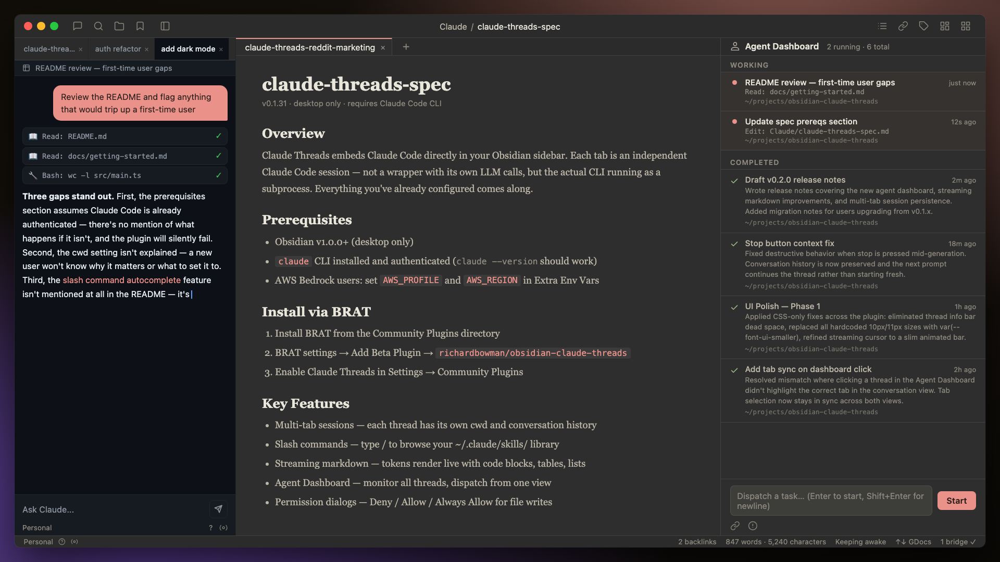
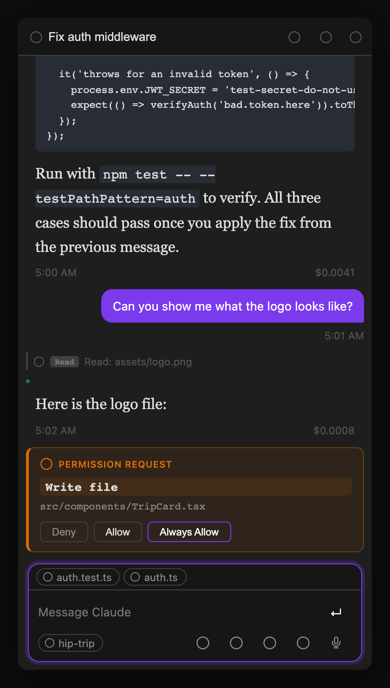
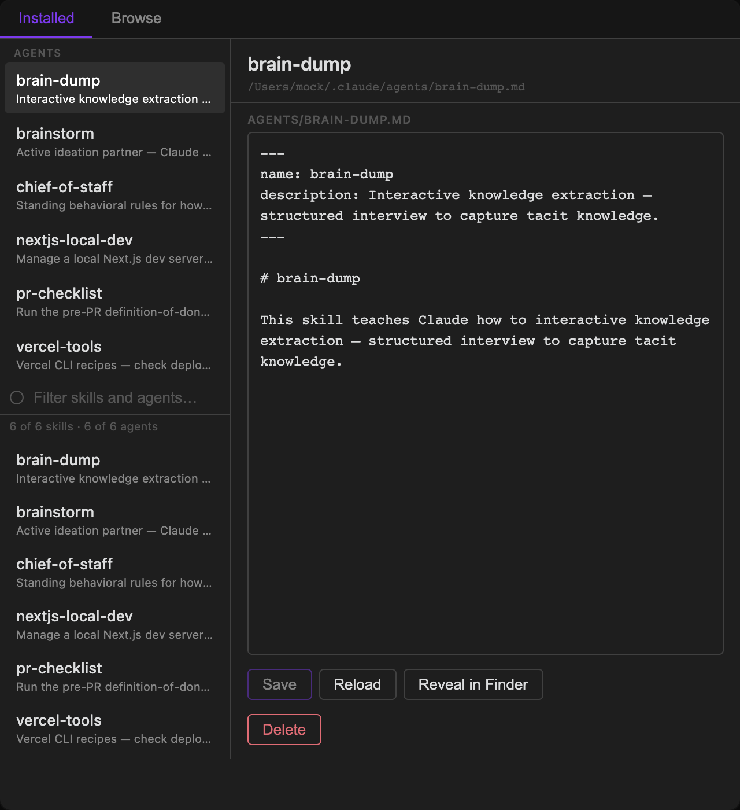
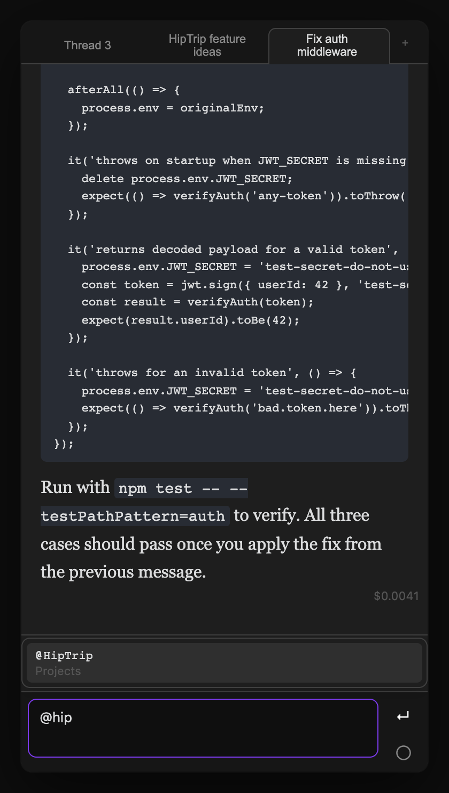
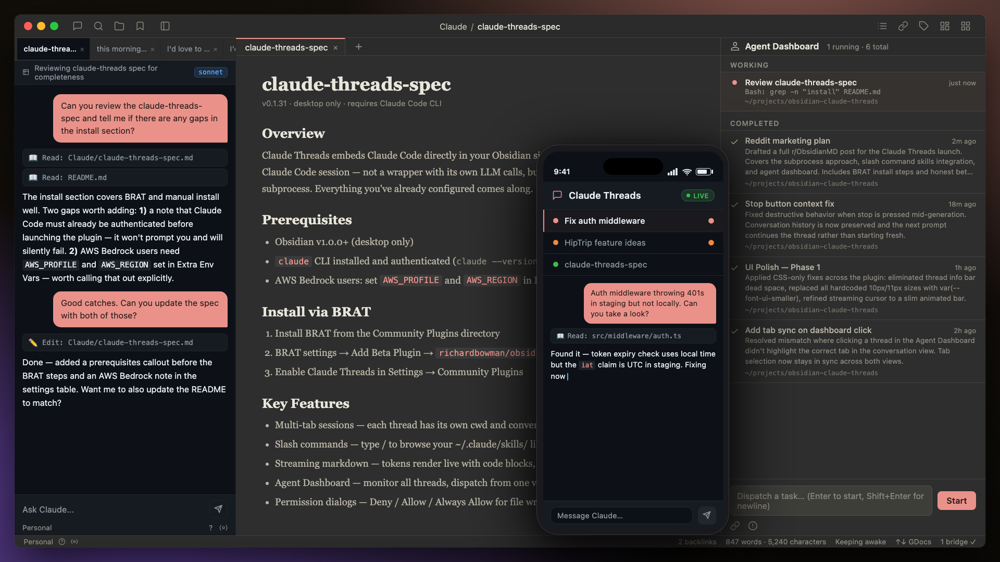
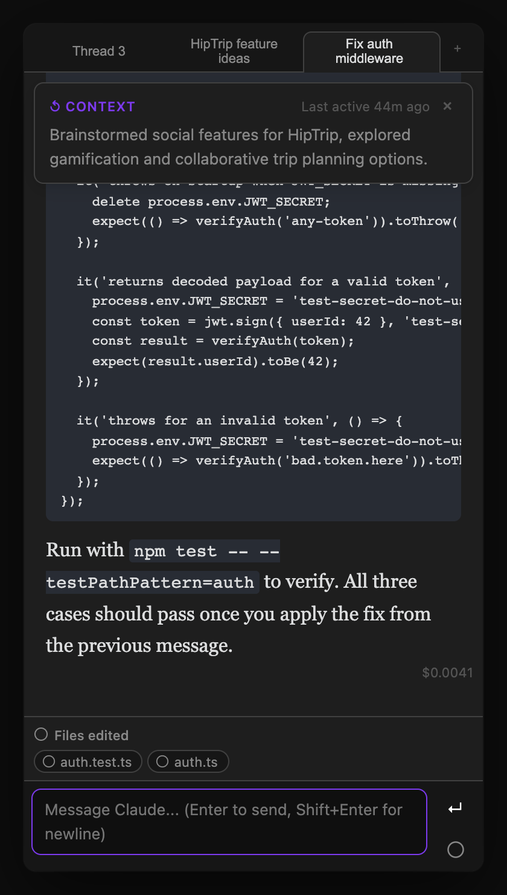

# Claude Threads for Obsidian

A native Obsidian sidebar plugin for running multiple Claude Code sessions in parallel — with streaming markdown responses, tab management, and deep vault integration.

 

<p align="center">
  
</p>

<p align="center">
  
</p>

<p align="center">
  
</p>

<p align="center">
  
</p>

## What it does

Claude Threads embeds Claude Code directly in your Obsidian sidebar. Each tab is an independent Claude Code session with its own working directory and conversation history. You can run multiple sessions in parallel — one debugging a bug, another drafting docs, another answering questions about your vault.

**Key features:**

- **Multi-tab sessions** — open as many Claude threads as you need, switch between them instantly
- **Streaming responses** — tokens stream in with live markdown rendering (code blocks, tables, lists, etc.)
- **Persistent conversations** — sessions resume where you left off after restarting Obsidian
- **Auto-naming** — tabs rename themselves based on what you're working on (powered by the summarizer)
- **Thread summaries** — a header bar shows what each thread is about, auto-updated after each response
- **Agent dashboard** — monitor and dispatch to multiple threads from a single view; attach images or files to dispatched tasks via the paperclip button or drag-and-drop; resolve pending permission requests directly from dashboard rows without switching threads; toggle between list view and **kanban board** to visualize agent state by column (idle, running, waiting, done); the Kanban has its own floating dispatch panel so you can launch new tasks without leaving the board view
- **Compressed conversation view** — toggle "Compress view" from the ⋯ menu to collapse an agentic thread's history into one-line summaries per exchange. Consecutive assistant turns (a full agentic run between two user messages) are grouped into a single summary entry. Click the expand arrow on any entry to read the full response. Summaries are generated lazily in a serial background queue so the UI never spawns multiple Claude processes at once
- **Focus edited files** — one click closes all other tabs and opens only the files Claude touched in this thread, snapping your workspace to the work
- **Workspace tab syncing** — the Obsidian workspace tab title automatically reflects the active thread so you always know which session is which
- **Slash commands** — built-in context commands plus your full `~/.claude/skills/` library, browseable with `/`
- **Model switching** — set a persistent model per thread with `/model fable|opus|sonnet|haiku`, or a global default in settings
- **Claude or Bedrock** — authenticate with your Claude account or route every session through Amazon Bedrock (one dropdown in settings)
- **Goals and loops** — pin a persistent goal on a thread with `/goal`, or re-run a prompt on an interval with `/loop 10m <prompt>`
- **Task list card** — Claude Code's task checklist (TodoWrite / TaskCreate) renders live above the input box: completed tasks struck through, the in-progress one highlighted, with done/in-progress/open counts
- **Context compaction** — auto and manual compaction shown as persistent dividers in the conversation
- **Permission dialogs** — Claude asks before writing files or running commands; you approve or deny inline
- **@ file mentions** — type `@` in the input to search vault files by name; selecting one injects its full content into the prompt as context; type `@this` to reference the currently open file without searching
- **Push-to-talk voice input** — hold a configurable hotkey to dictate a message via speech-to-text (uses the Claude Code STT pipeline); transcript populates the input box ready to send or edit
- **Projects** — group threads by vault sub-folder with a shared context prompt injected into every message
- **Draft persistence** — input text and attachments auto-save when switching threads and survive plugin reloads
- **First-run onboarding** — on first install, a welcome guide walks you through setup and opens a three-panel workspace (conversation, Agent Dashboard, and an example thread) so the layout makes sense before you write a single message
- **Context recap banner** — when you return to a thread you haven't viewed in over a minute, a floating banner shows the thread summary and how long ago you were last active; auto-dismisses after 10 seconds
- **Keep computer awake** — prevents the Mac from sleeping while Claude is active; shows a ☕ indicator in the status bar (uses `caffeinate -i` on macOS, Web Lock API as fallback)
- **Tool call visibility** — see exactly which files Claude is reading/writing during each response
- **Cancel and restore** — press Escape (or click Stop) while Claude is running to cancel; the sent message pops back into the input box ready to edit and re-send
- **Keyboard shortcuts** — navigate tabs without touching the mouse

## Prerequisites

- [Obsidian](https://obsidian.md) v1.0.0 or later (desktop only)
- [Claude Code CLI](https://docs.anthropic.com/en/docs/claude-code) installed and authenticated
  - The plugin auto-detects `claude` at `/opt/homebrew/bin/claude`, `/usr/local/bin/claude`, or `~/.local/bin/claude`
  - AWS Bedrock / SSO users: set `AWS_PROFILE` and `AWS_REGION` in the plugin's Extra Environment Variables setting

## Installation

### Via BRAT (recommended for early access)

1. Install the [BRAT plugin](https://github.com/TfTHacker/obsidian42-brat) from Obsidian's Community Plugins
2. Open BRAT settings → **Add Beta Plugin**
3. Enter: `rbcodelabs/obsidian-claude-threads`
4. Enable **Claude Threads** in Settings → Community Plugins

### Manual install

1. Download the latest release from [GitHub Releases](https://github.com/rbcodelabs/obsidian-claude-threads/releases)
2. Extract into your vault's plugin folder: `<vault>/.obsidian/plugins/claude-threads/`
3. Enable **Claude Threads** in Settings → Community Plugins

## Usage

Click the **message-square** icon in the left ribbon, or run **Open Claude Threads** from the command palette.

### Tabs

| Action | How |
|---|---|
| New thread | Click `+` in the tab bar |
| Close thread | Hover a tab → click `×` |
| Rename thread | Double-click the tab label |
| Switch to tab N | `Cmd+1` through `Cmd+9` |
| Next / previous tab | `Cmd+]` / `Cmd+[` |

Tabs are renamed automatically after the first exchange using the thread summarizer — no need to name them yourself.

### Sending messages

- **Enter** — send message
- **Shift+Enter** — newline
- **`/`** — opens slash command autocomplete
- **Escape** — cancel the running session; the sent message is restored to the input box so you can edit and re-send

### Slash commands

Type `/` in the input box to see built-in context commands and your installed Claude Code skills. Navigate with arrow keys, Tab, or Enter.

**Built-in commands** (handled by the plugin):

| Command | What it does |
|---|---|
| `/model fable\|opus\|sonnet\|haiku` | Set a persistent model for this thread |
| `/model default` | Reset thread model back to the global default |
| `/model` | Show the current model for this thread |
| `/goal <text>` | Set a persistent goal for this thread — injected into every turn until cleared |
| `/goal clear` | Clear the thread's goal (`/goal` alone shows the current goal) |
| `/loop <interval> <prompt>` | Re-run a prompt in this thread on an interval (e.g. `/loop 10m check CI`) |
| `/loop stop` | Stop the thread's loops (`/loop` alone lists them) |
| `/compact` | Summarize conversation history to free up context window |
| `/clear` | Clear conversation history and start a fresh session |
| `/cost` | Show token usage and cost for the current session |

**Command pills** — when you complete a built-in command (type `/goal ` or pick one from the dropdown), it turns into a pill chip at the left of the input box. Type the arguments after it; a single Backspace at the start of the input (or clicking the pill's ×) deletes the whole command. After a command, argument autocomplete kicks in — `/model ` offers `fable|opus|sonnet|haiku|default`.

**Skills** — any `.md` file (or directory) in `~/.claude/skills/` appears below the built-in commands. Selecting one inserts the skill name into your message, which Claude handles via your `CLAUDE.md` configuration.

### Skills Manager

Open the **Skills Manager** panel from the ribbon (puzzle icon) or command palette to browse, install, and edit Claude Code skills.

<p align="center">
  
</p>

**Installed tab** — lists every skill in `~/.claude/skills/`. Click a skill to view and edit its `SKILL.md` directly in the panel. The editor shows an unsaved-changes indicator (`●`) and a **Save** button when there are pending edits. **Reload** re-reads the file from disk. **Reveal in Finder** opens the skill's directory. **Uninstall** removes the skill (with a confirmation prompt).

**Browse tab** — search the [skills.sh](https://skills.sh) registry. Results show the skill name, GitHub source, and install count. Click a result to see details and an **Install** button that clones the skill from GitHub into `~/.claude/skills/`.

### @ file mentions

Type `@` anywhere in the input box to search vault files by name. A dropdown appears showing up to 20 matching files — navigate with arrow keys and press Tab or Enter to insert.

<p align="center">
  
</p>

Selecting a file inserts `@[[filename]]` into your message. When you send the message, the plugin resolves each mention and appends the file's full content as context for Claude — useful for asking Claude to work with a specific note, doc, or config file without copying and pasting.

Type `@this` (no search needed) to instantly reference the currently active file in Obsidian. It resolves to the same `@[[filename]]` injection at send time.

### Model switching

`/model` sets the model for all subsequent turns in a thread:

```
/model fable    → uses Claude Fable 5 for every turn in this thread
/model opus     → uses Claude Opus for every turn in this thread
/model sonnet   → switches to Sonnet
/model haiku    → switches to Haiku
/model default  → resets to the plugin's Default model setting (or the CLI default)
```

A **Default model** dropdown in settings picks the model for threads that have no `/model` override.

The active model is shown as a badge in the thread info bar. You can also use `/escalate` as a one-turn override — it routes just that message to the Escalation model chosen in settings (Fable 5, Opus, Sonnet, or Haiku), then the thread model resumes. Both the keyword and the target model are configurable.

### Context compaction

When the context window fills up, Claude compacts the conversation automatically. You can also trigger it manually with `/compact`. Either way, a divider appears in the conversation showing when compaction happened and how many tokens were in context beforehand. Compaction markers are persisted and survive plugin reloads.

### Agent dashboard

Open the **Agent Dashboard** from the ribbon or command palette to see all threads at a glance. Each thread appears as a row showing its name, working directory, current model, and status.

**Live activity (running threads):** While a thread is actively processing, the dashboard shows a live one-line summary of the current tool call or step — so you can see "Reading src/components/Header.tsx" or "Running npm test" without switching to that tab.

**Auto-generated summaries (idle threads):** After each completed response, the summarizer runs in a lightweight background process (a separate Claude Code instance using a small model) and writes a multi-sentence recap of what that thread worked on. This summary is shown in the dashboard row so you can re-orient yourself to any thread at a glance — what it accomplished, what files it touched, what's left to do.

This combination means you can dispatch several threads in parallel, switch to other work, then return to the dashboard to understand the state of every agent without reading through each conversation.

You can also send messages to any thread directly from the dashboard without switching tabs.

Toggle the **Kanban** button in the dashboard toolbar to switch from the default list view to a board layout with columns for each agent state: **Working**, **Awaiting** (permission), **New** (unreviewed), **Done**, **Failed**, and **Ready** (empty). Columns are sorted most-recently-active first. The Kanban view has its own floating dispatch panel at the bottom — type a task and press Enter to launch a new thread without leaving the board. List view is the default; the preference persists across reloads.

### Push-to-talk voice input

Hold the configured push-to-talk key (default: none — set it in Settings → Push to Talk Hotkey) and speak. The microphone activates while you hold the key; releasing it stops recording and transcribes your speech using the Claude Code STT pipeline. The transcript populates the input box so you can review and edit before sending. The floating input panel highlights while recording so you always know the mic is live.

### Permissions

When Claude needs to write a file or run a command, a permission card appears inline in the conversation asking you to **Allow**, **Deny**, or **Always Allow**. Always Allow adds the tool to a per-vault allowlist so you're never asked again for that tool. You can also resolve permissions directly from the Agent Dashboard without switching threads. The default behavior can be changed globally in settings.

### Remote access (mobile)

Claude Threads can mirror your desktop sessions to Obsidian Mobile in real time. Your phone becomes a thin client: you can read the conversation as it streams, send messages, approve permission requests, and switch between threads — all over a secure WebSocket relay. The desktop does all the actual Claude work; mobile just shows the state.

**Prerequisites:**

- Obsidian desktop with Claude Threads installed and running
- Obsidian Mobile with Claude Threads installed via [BRAT](https://github.com/TfTHacker/obsidian42-brat)
- Both devices on any internet connection (no LAN required)

**Setup:**

1. On desktop: open Settings > Claude Threads > Remote Access and toggle **Enable remote access** on
2. Click **Show pairing QR code** — a QR code appears with a 5-minute expiry window
3. On mobile: open the Claude Threads ribbon icon, tap **Connect to Desktop**, then scan the QR code (or tap the `claude-threads://pair` link if you're on the same device)
4. The mobile view refreshes to show all your desktop threads

**Manual pairing (URI scheme):**

If you can't scan a QR code, send yourself the pairing link directly:

```
claude-threads://pair?roomId=<ROOM_ID>&relay=<RELAY_URL>
```

Opening this URL on any device with Obsidian Mobile + Claude Threads installed will pair it to your desktop.

**Limitations:**

- Desktop must be running and connected — mobile cannot start new Claude sessions without desktop
- Mobile is a read-mostly thin client; it cannot access your vault files or run tools directly
- One desktop per room ID; rotate the room ID in settings to revoke all mobile access

<p align="center">
  
</p>

### Compressed conversation view

Long agentic threads — especially ones with many tool calls spread across dozens of turns — can be hard to scan. Toggle **Compress view** from the `⋯` menu (top-right of the conversation panel) to collapse the history into a scannable list of one-line summaries.

**How it works:**

- Each entry represents one *exchange*: a user message followed by all the consecutive assistant turns that came back before the next user message (i.e., a full agentic run)
- The summary for each entry is generated by running the combined content of all assistant turns through a lightweight background process — so you get one meaningful summary ("Investigated codebase, added 4 MCP tools, wrote tests") rather than N fragments
- Summaries are generated lazily in a serial queue (one at a time) so toggling compress view on a 50-message thread won't spawn 50 simultaneous Claude processes
- Click the **⌄** arrow on any entry to expand it and read the full response with all tool calls intact
- Toggle the menu item again (now labelled **Expand view**) to return to the normal conversation view

Summaries are cached in memory for the session. They regenerate on the next reload — which keeps storage simple while keeping the background work cheap (the in-process model is fast and inexpensive).

### Thread summaries

A summary bar above the messages shows what the thread is about. It updates automatically after each response if **Auto-summarize** is enabled, or you can trigger it manually with the brain icon. The summarizer updates the tab name — auto-summarize only does this when the name is still the default "Thread N"; manual summarize always applies the new title regardless of what the tab is currently named.

When you switch back to a thread you haven't viewed in over a minute, a **context recap banner** floats at the top of the conversation showing the thread summary and how long ago you were last active. It auto-dismisses after 10 seconds or when you send a message.

<p align="center">
  
</p>

### Projects

Projects group threads by vault sub-folder and inject shared context into every message, so Claude always knows what it's working on.

**Creating a project:** Go to Settings → Projects → enter a project name and vault folder path → click **Create project**. You can also add a project context prompt — a few sentences describing the project's goals, conventions, and key files that Claude should always keep in mind.

**Opening a thread in a project:** When you create a new thread, select a project from the dropdown near the input box. The thread's working directory is set to the project's vault folder, and the project context is prepended to every message you send.

**Managing projects:** Edit the name, folder, or context prompt at any time in Settings → Projects. Deleting a project keeps all its threads — they just lose the project association.

## Agent tools reference

Every Claude thread runs with a built-in MCP server that exposes tools for vault access, session control, and — for multi-agent workflows — live coordination with other threads. These tools are available automatically; no configuration is required.

### Vault tools

Read and search your Obsidian vault from within any thread.

| Tool | Parameters | Description |
|---|---|---|
| `obsidian_search_vault` | `query`, `limit?` | Full-text search across all Markdown files. Tokenizes multi-word queries so each term is matched independently. Returns results ranked by relevance (filename hits weighted 10×) with a ~300-char excerpt from the densest matching region. Default limit: 20. |
| `obsidian_get_note_metadata` | `path` | Returns the full metadata cache entry for a note: frontmatter, tags, wikilinks, and headings. |
| `obsidian_get_backlinks` | `path` | Returns all notes that link to the specified file, with source path and original link text. |
| `obsidian_get_outgoing_links` | `path` | Returns all wikilinks and Markdown links a note makes to other files, with display text and resolved vault paths. |

### UI tools

Interact with the active Obsidian workspace.

| Tool | Parameters | Description |
|---|---|---|
| `obsidian_get_active_file` | — | Returns metadata (path, basename, extension, size, mtime, ctime) for the file currently open in the editor, or `null` if nothing is open. |
| `obsidian_get_open_tabs` | — | Returns all open tabs with path, title, view type, and which one is active. |
| `obsidian_navigate_to_file` | `path`, `newLeaf?` | Opens a vault file in the editor. Pass `newLeaf: true` to open in a new tab. |
| `obsidian_insert_at_cursor` | `text` | Inserts text at the cursor in the active editor, replacing any current selection. |
| `obsidian_list_commands` | `query?` | Returns all registered Obsidian commands (id + name), sorted alphabetically. Pass a `query` string to filter. Use this to discover command IDs before calling `obsidian_execute_command`. |
| `obsidian_execute_command` | `commandId` | Runs any Obsidian command by its ID (e.g. `obsidian-git:push`, `editor:toggle-bold`). Returns success or failure. |

### Session tools

Control the current thread's session state.

| Tool | Parameters | Description |
|---|---|---|
| `set_working_directory` | `path` | Changes the working directory for this session. Accepts an absolute path; `~` is expanded. Takes effect on the next turn. |
| `ScheduleWakeup` | `delaySeconds`, `prompt`, `reason` | Schedules a message to be injected into this thread after a delay. Useful for polling CI, waiting for a deploy, or self-pacing a loop. The `reason` field is shown in the UI. |
| `enter_worktree` | `branch?`, `baseBranch?`, `repoPath?` | Creates a git worktree for the current repo and switches the session cwd to it. Use this instead of the built-in SDK `EnterWorktree` — this version tracks the in-session cwd correctly after `set_working_directory`. |
| `exit_worktree` | `worktreePath?`, `force?` | Removes the worktree and restores the session cwd to the original repo root. Defaults to the current effective cwd. Pass `force: true` to remove even if there are uncommitted changes. |
| `fork_conversation` | `focus_area?` | Forks the current conversation into a new independent thread. A lightweight Claude call distills the history into a focused starting prompt. The current thread continues unaffected. |

### Thread coordination tools

Discover, read, and message other running threads. These tools enable agent-to-agent delegation — one thread can assign work to another, wait for it to finish, and read the result.

| Tool | Parameters | Description |
|---|---|---|
| `obsidian_get_current_thread` | — | Returns this thread's own metadata: `id`, `title`, `status`, `isRunning`, `projectId`, `cwd`, `updatedAt`, `messageCount`. Useful for knowing your own context before coordinating with peers. |
| `obsidian_list_threads` | — | Returns all threads with the same metadata fields as `obsidian_get_current_thread`, including a live `isRunning` flag. |
| `obsidian_list_projects` | — | Returns all configured projects: `id`, `name`, `description`, `vaultFolder`. Useful for deciding which project context a new thread should use. |
| `obsidian_get_thread_messages` | `threadId`, `limit?` | Returns the live message history for any thread. Messages are filtered to `user` and `assistant` roles (internal compaction markers are excluded). Default: last 20 messages. |
| `obsidian_wait_for_thread` | `threadId`, `timeoutSeconds?` | Blocks until the target thread finishes its current request (`isRunning` → `false`). Polls every second. Returns `{ done: true, elapsedSeconds }` on success, or `{ timedOut: true }` if the timeout is reached (default 120s, max 600s). Returns immediately if the thread is already idle. |
| `obsidian_send_message_to_thread` | `threadId`, `message` | Queues a user message on another thread and triggers Claude to process it. Returns immediately once the message is enqueued — use `obsidian_wait_for_thread` to block until the response is ready. Cannot send to the current thread. |
| `obsidian_archive_thread` | `threadId` | Saves the thread as a vault note (if vault save is enabled) then removes it from the active thread list. Use at the end of a release or multi-step session to close out completed threads automatically. A thread cannot archive itself. |
| `obsidian_open_url` | `url`, `newTab?` | Opens a URL in the Obsidian Web Viewer panel. Reuses an existing Web Viewer tab by default; set `newTab: true` to force a fresh tab. Useful for opening local dev servers (`http://localhost:…`), HTML prototypes, or any web page directly from an agent without manual URL entry. |

**`isRunning` vs `status`:** `status` is a persisted field (`waiting`, `active`, `error`, `archived`) that reflects the last known state. `isRunning` is a live flag that is `true` only while Claude is actively streaming a response. Use `isRunning` for coordination decisions; use `status` to filter out archived or errored threads.

#### Coordination pattern

A typical delegation loop:

1. Call `obsidian_list_threads` to find a peer, or `fork_conversation` to create a dedicated one
2. Call `obsidian_send_message_to_thread` to assign a task
3. Call `obsidian_wait_for_thread` to block until the peer finishes
4. Call `obsidian_get_thread_messages` to read the result

```
Thread A                              Thread B
  │                                      │
  ├─ obsidian_list_threads               │
  ├─ obsidian_send_message_to_thread ───►│ (Claude receives message)
  ├─ obsidian_wait_for_thread            │
  │   (polls isRunning every 1s)         ├─ ... processes task ...
  │◄────────────────────────────────────┤ (isRunning → false)
  └─ obsidian_get_thread_messages        │
       (reads the result)
```

This pattern works across any combination of threads — you can fan out to multiple peers simultaneously by sending messages to several threads before waiting on any of them.

### Vault Bridges integration

If you have the [Vault Bridges](https://github.com/rbcodelabs/obsidian-vault-bridges) plugin installed, Claude agents can inspect and configure bridges directly via MCP — no config-file editing or Obsidian restarts required.

| Tool | Parameters | Description |
|---|---|---|
| `obsidian_list_vault_bridges` | — | Returns all currently configured bridges. Agents should call this first to check what already exists before adding a new one. |
| `obsidian_add_vault_bridge` | `name`, `repoPath`, `vaultPath`, `sourcePath?`, `branch?`, `autoSync?`, `syncNow?` | Adds a new bridge live via the Vault Bridges API. The bridge is registered immediately — the status bar updates, per-bridge push/pull commands are wired up, and settings are saved. If a bridge with the same `repoPath` + `vaultPath` already exists, the existing record is returned without creating a duplicate. |

Both tools return a clear error if the vault-bridges plugin is not installed or not enabled.

## Settings

| Setting | Description |
|---|---|
| Claude binary path | Path to the `claude` executable (auto-detected) |
| Default working directory | `cwd` for new threads; defaults to vault root |
| Save threads to vault | Auto-save conversations as Markdown notes |
| Vault folder | Folder for saved thread notes (default: `Claude/`) |
| Extra environment variables | `KEY=VALUE` pairs injected into Claude's environment (useful for `AWS_PROFILE`, `AWS_REGION`) |
| Secret environment variables | Keychain-backed env vars (values stored in the OS keychain, never in `data.json`) — for API keys and tokens |
| Permission mode | `Accept edits automatically`, `Bypass all permissions`, or `Prompt for permissions` |
| Layout density | `Comfortable`, `Compact`, or `Spacious` — controls message spacing and padding |
| Enable summarization | Show the summarize button and auto-summarize |
| Auto-summarize after response | Regenerate summary + tab name after each assistant turn |
| Claude summarization model | Model alias for summarization (e.g. `haiku`, `sonnet`) |
| Escalation keyword | Keyword that routes a single turn to the escalation model (default: `/escalate`) |
| Escalation model | Model the escalation keyword targets (default: Opus) |
| Keep computer awake | Prevent the Mac from sleeping while Claude is processing; shows ☕ in the status bar |
| Projects | Group threads by vault sub-folder with a shared context prompt |
| Remote access | Enable/disable mobile remote access via WebSocket relay |
| Room ID | Shared secret used to pair mobile (rotate to revoke all access) |
| Show pairing QR | Display a QR code for one-time mobile pairing (expires in 5 minutes) |

## Building from source

```bash
git clone https://github.com/rbcodelabs/obsidian-claude-threads
cd obsidian-claude-threads
npm install
npm run build
# Output is in dist/
```

## Releasing

The project uses a worktree-based workflow — edits directly to the main checkout are blocked by a git hook. Follow these steps:

1. **Create a worktree** for the version bump:
   ```bash
   git worktree add .claude/worktrees/chore/bump-version-X.Y.Z -b chore/bump-version-X.Y.Z
   cd .claude/worktrees/chore/bump-version-X.Y.Z
   ```

2. **Bump the version** in `manifest.json` and `package.json` (both must match), then commit and push:
   ```bash
   git add manifest.json package.json
   git commit -m "chore: bump version to vX.Y.Z"
   git push -u origin chore/bump-version-X.Y.Z
   ```

3. **Open and squash-merge a PR** for the version bump:
   ```bash
   gh pr create --title "chore: bump version to vX.Y.Z" --body "Version bump." --base main
   gh pr merge <number> --squash --delete-branch
   ```

4. **Pull main and push the tag** to trigger the release workflow:
   ```bash
   git pull origin main
   git tag vX.Y.Z
   git push origin vX.Y.Z
   ```

5. That's it. The [release workflow](.github/workflows/release.yml) automatically builds the plugin and publishes a GitHub release with `main.js`, `styles.css`, and `manifest.json` attached — BRAT will pick it up within a few minutes.

## License

MIT
