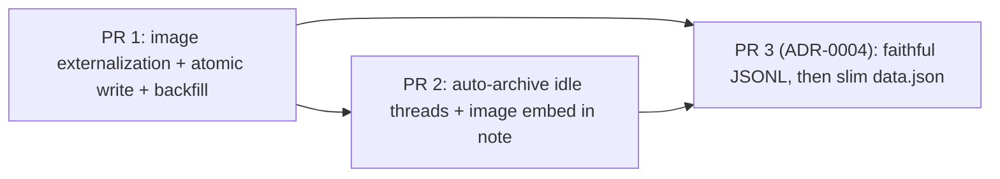

# ADR-0003: data.json bloat and torn-read corruption

**Repo:** `~/projects/obsidian-claude-threads` (plugin id `claude-threads`)
**Date:** 2026-08-13
**Status:** Proposed
**Supersedes / relates to:** builds on the investigation note [[Claude/claude-threads-data-json-bloat-2026-08-12]]. Sits alongside `docs/adr/0002-long-lived-thread-session.md`. If accepted, land a copy in the repo as `docs/adr/0003-data-json-persistence.md` to match the repo's numbering.

> Numbering note: the repo's ADRs live in `docs/adr/` and run `0001`, `0002`. This is the next in sequence, so it is ADR-0003. The vault copy uses the filename Rick specified; the repo copy should use `0003-...`.

## Context

The plugin persists conversation state in three layers (verified by reading the source):

| Layer | File(s) | Written by | Scales? |
|---|---|---|---|
| `data.json` | one file at `<pluginDir>/data.json` | `main.ts` `saveSettings()` → `runSaveLoop()` (lines 1803-1833) → Obsidian `saveData()` | No. Full-file rewrite of every thread's full message list on every save, called from ~106 sites. |
| Raw JSONL log | `<vaultFolder>/logs/<threadId>.jsonl` | `RawLogWriter.ts` `append()` (append-only, per-file promise chain) | Yes. |
| Markdown note | `<vaultFolder>/<date>-<slug>.md` | `VaultPersistence.ts` `saveThread()` | Yes, but a lossy render (no images, no tool calls, no timestamps/cost). |

Four confirmed problems, verified against this vault's live 12.7MB `data.json` (37 threads):

1. **Images are ~83% of the file.** `ChatMessage.images` (user-pasted, `types.ts` line 49) and `ChatMessage.toolResultImages` (tool outputs such as Read-on-a-PNG or browser screenshots, `types.ts` line 53) are stored inline as base64 and serialized whole into `data.json`. Measured 10.5MB of 12.7MB.
2. **`/compact` prunes nothing.** `ThreadManager.ts` `onCompact` (line 1442) only pushes a `role: 'compact'` divider into `thread.messages` (line 1451). Nothing before the divider is ever removed.
3. **Archival works but is manual-only.** `main.ts` `archiveThread()` (line 383) correctly evicts a thread: it writes the markdown note (`persistence.saveThread`), then `manager.deleteThread(id)` (line 390) drops it from the map that `runSaveLoop()` serializes. Nothing triggers it automatically, so 37 threads stay resident.
4. **Every save is a non-atomic full-file rewrite.** `runSaveLoop()` (line 1822) rebuilds `this.settings.threads` from `manager.getThreads()` and calls `await this.saveData(this.settings)` (line 1828). Reading the live file five times during an active session produced two `Unterminated string` torn reads. Obsidian's `saveData()` write is not atomic, so any external reader (Obsidian Sync, a backup job, a script) can catch it mid-write. This is the corruption vector behind the 17MB machine.

### Constraints that shape the design

- **Mobile has no `ThreadManager`.** `runSaveLoop()` guards `if (this.manager)` (line 1818); on mobile `manager` is null and thread state is fed over the relay into `MobileThreadStore.ts` (frames appended at line 161). Mobile has no `FileSystemAdapter` and cannot resolve a desktop attachment file. Any image or atomic-write change must be desktop-manager-scoped and must not break the relay frame that carries live images to mobile.
- **The render path is synchronous and assumes inline base64.** Every image site sets `img.src = data:${mediaType};base64,${data}` directly (`ThreadsView.ts` lines 2117-2124, 2187-2194, 3168-3174, 3316-3320, 3637-3646). A fix must keep the render synchronous.
- **`app://` resource URLs are already used.** `main.ts` `getPluginResourceUrl()` (line 1305) calls `this.app.vault.adapter.getResourcePath(vaultRelativePath)`, which returns a synchronous `app://` URL usable directly as an `img.src`. This is the mechanism that lets externalized images render without an async read.
- **The markdown note round-trip is lossy today.** `VaultPersistence.threadToMarkdown` (line 138) drops images; `parseMessages` (line 229) reconstructs only user/assistant text, discarding tool calls, images, timestamps, cost, and compact markers. So a thread rehydrated from its note is a text-only shadow of the live thread.
- **JSONL fidelity is partial.** `onRawEvent` (`ThreadManager.ts` line 1202) logs verbatim SDK events. Tool-result images arrive as SDK `user` messages and ARE in the JSONL. User-*pasted* images are injected by the plugin via `session.send(prompt, images)` and appended to `thread.messages` directly (`sendMessage` line 870); they are not guaranteed to appear as a logged raw event. So JSONL is a faithful source for tool-result content but not necessarily for user-pasted images.

## Decision Drivers

- Cut `data.json` size by the ~80% that images represent, with the smallest blast radius.
- Eliminate the torn-read corruption risk independent of size.
- Do not lose user data during migration of already-bloated files.
- Do not break mobile (relay-fed, no filesystem).
- Keep the render path synchronous.
- Prefer changes that can ship as one self-contained, low-risk PR, and defer the load-path rewrite until it can be done safely.

## Considered Options (by change)

### Change 1: Externalize images out of data.json

| Option | Pros | Cons |
|---|---|---|
| **1A. Externalize at persistence time; keep base64 in memory** (recommended) | Render and relay keep working unchanged (base64 stays in the live message); disk holds only a path ref; mobile keeps getting base64 over the relay; migration is idempotent | Live message objects carry two representations (base64 + path) until the next reload |
| 1B. Externalize eagerly and drop base64 from the in-memory message | Simplest in-memory shape | Breaks the synchronous render and the relay frame; would force async reads and mobile can't resolve the path |
| 1C. Move images into the JSONL log only, reconstruct on demand | Reuses an existing scaling layer | JSONL does not reliably hold user-pasted images; reconstruction is async and complex; couples display to log parsing |

### Change 2: Auto-archive idle threads

| Option | Pros | Cons |
|---|---|---|
| **2A. Startup sweep + periodic interval, reusing `archiveThread`** (recommended) | Reuses the already-correct eviction path; mirrors the existing `archiveOrphanedNotes` startup scan | Rehydration of an auto-archived thread is lossy today (text only) unless the note render is upgraded |
| 2B. Startup-only sweep | Minimal | A long-running desktop session never sweeps |
| 2C. Do nothing, rely on manual archive | Zero code | The resident-thread accumulation continues |

### Change 3: Atomic write of data.json

| Option | Pros | Cons |
|---|---|---|
| **3A. Desktop temp-file + `fs.rename`; mobile falls back to `saveData`** (recommended) | Atomic on the same filesystem; `require('fs')` already used in `RawLogWriter`; mobile path unchanged | Bypasses Obsidian's `saveData` on desktop, so it must write the exact same path/format that `loadData` reads |
| 3B. Write a sidecar file and keep calling `saveData` too | Keeps Obsidian's own write | Two writers, two sources of truth, more torn-read surface, not less |
| 3C. Leave `saveData` as-is | No work | Corruption risk remains |

### Change 4: Stop storing full message history in data.json

| Option | Pros | Cons |
|---|---|---|
| 4A. Metadata + last-N in data.json, hydrate full history on demand | Largest long-term size win; makes saves cheap | Touches the core load/hydrate path (`loadThreads`, crash recovery at `main.ts` 895-943); needs a faithful rehydration source, which does not exist yet |
| **4B. Defer to a follow-up ADR, gated on making JSONL faithful** (recommended) | Keeps this ADR shippable and low-risk; sequences the risky work behind a prerequisite | The size win from message text (not images) is deferred |
| 4C. Reject outright | Simplest | Leaves the full-rewrite cost in place forever |

## Decision

### Change 1: Externalize images. ADOPT now (Option 1A).

**Where files live.** `<vaultFolder>/attachments/<threadId>/<messageId>-<index>.<ext>`, mirroring the existing per-thread `logs/<threadId>.jsonl` convention in `RawLogWriter`. Per-thread directory keying makes cleanup a single directory removal.

**Reference shape.** Extend the two types in `types.ts` to carry an optional path and make base64 optional, so both representations can coexist and old data still parses:

```ts
export interface ImageAttachment {
  base64?: string;        // was required; now optional (transient / legacy / relay)
  mediaType: ImageMediaType;
  name: string;
  path?: string;          // NEW: vault-relative path once externalized
}

// ChatMessage.toolResultImages element:
{ mediaType: string; data?: string; path?: string }   // data was required; now optional
```

**Write path.** When a message with images is finalized (user images in `ThreadManager.sendMessage` around line 868; tool-result images in `onMessage` around line 1245), schedule an async write of each image to its attachment file via `app.vault.createBinary(path, arrayBuffer)` and set `path` on the ref. Keep `base64`/`data` in the in-memory object so live render and the relay frame are unchanged.

**Serialize path.** In `runSaveLoop()` (line 1822), where the code already strips `statusTags`, add a mapping step: for any image ref that has a `path`, drop `base64`/`data` from the serialized copy (keep it in the live object). If `path` is not set yet (write still in flight), keep base64 this pass; it externalizes on the next save. This is what actually removes the bytes from `data.json`.

**Render path.** Change each `img.src` site to prefer the externalized file: if `path` is set, `img.src = this.app.vault.adapter.getResourcePath(path)` (synchronous `app://` URL, same call already used at `main.ts` 1305); else fall back to the base64 `data:` URL. Sites: `ThreadsView.ts` 2117-2124, 2187-2194, 3168-3174, 3316-3320, 3637-3646.

**Cleanup.** In `ThreadManager.deleteThread` (line 328, which already deletes several per-thread maps), remove the `<vaultFolder>/attachments/<threadId>/` directory. Because `archiveThread` calls `deleteThread`, archived threads' attachment files must be preserved BEFORE eviction only if the note references them (see Change 2); otherwise deletion of a still-referenced file would blank the note. Decision: on archive, do NOT delete the attachment directory (the note may embed those images); on a true hard delete of a thread that was never archived, delete it. Concretely: gate the directory removal on "no markdown note exists for this thread," or always keep the directory and rely on the auto-archive/orphan sweep for eventual cleanup. Keeping the directory is the safe default.

**Encoding helper.** base64 to `ArrayBuffer` via a small decode (`atob` then `Uint8Array`), or Obsidian's `base64ToArrayBuffer` if present. Confirm the exact helper at implementation time (see Open Questions).

### Change 2: Auto-archive idle threads. ADOPT as a follow-up PR (Option 2A).

- **Idle criteria:** `status === 'waiting'` (terminal-ish) AND `updatedAt` older than N days (default 14, a setting). Never archive `active`, `reconnecting`, `error`, or a thread with a pending plan/question, or the `orchestratorThreadId`.
- **Where it runs:** a startup sweep placed alongside the existing orphan scan (`main.ts` 883-893) and a low-frequency interval (for example once every 6 hours) so long desktop sessions still sweep.
- **Reuse:** call the exact `archiveThread` eviction path (set `status='archived'`, `persistence.saveThread`, `manager.deleteThread`, `saveSettings`). Do not fork a second eviction implementation.
- **Rehydration honesty:** because the note round-trip is lossy (no images, no tool calls), a reopened auto-archived thread would today come back as text only. Two acceptable resolutions, decided here:
  1. Upgrade `threadToMarkdown` to embed images as `![[<attachment path>]]` so at least images survive visibly in the note, and accept that tool-call/cost detail is not rehydrated into live state (it remains in the JSONL log for agent queries).
  2. Treat auto-archived threads as intentionally not fully rehydratable into live state: reopening shows the note render plus a link to the JSONL log, not a byte-perfect live thread.
  Recommendation: ship 2A with resolution (1) for images (small, high-value) and explicitly accept the tool-call/cost loss. Do not block auto-archive on a full faithful round-trip; that belongs to Change 4.

### Change 3: Atomic write. ADOPT now, in the same PR as Change 1 (Option 3A).

- Add a `saveDataAtomic()` used by `runSaveLoop()` instead of `this.saveData()`.
- **Desktop** (`this.app.vault.adapter instanceof FileSystemAdapter`, the guard already used at `main.ts` 499 and 1323): compute `basePath = adapter.getBasePath()` and `dataPath = join(basePath, this.manifest.dir, 'data.json')`; write JSON to `dataPath + '.tmp'`, then `fs.promises.rename(tmp, dataPath)` (atomic on one filesystem). `require('fs')`/`require('path')` are already used in `RawLogWriter`.
- **Mobile / non-FileSystemAdapter:** fall back to `await this.saveData(this.settings)` unchanged.
- **Compatibility:** the atomic writer must produce the identical path and JSON that `this.loadData()` reads (used at `main.ts` 689 and 1730). It does, because it writes the same `data.json` Obsidian would. Keep exactly one writer in flight (the existing `savePromise` coalescing at 1800-1809 already guarantees this).

### Change 4: Slim data.json to metadata + last-N. DEFER to ADR-0004 (Option 4B).

Out of scope now. It touches `loadThreads` (line 284), the startup hydrate, and crash recovery (`main.ts` 895-943), and it needs a faithful rehydration source that does not exist yet. Prerequisite: make the JSONL log a faithful, replayable source (including user-pasted images, which today may not be logged), then a follow-up ADR can decide the metadata/last-N split. Once Change 1 lands, images are already out of `data.json`, so the remaining bloat is message text, which is far smaller and less urgent.

### On `/compact` pruning (investigation note item 2)

Not adopted as a fix. Pruning pre-compact messages from `thread.messages` would silently destroy visible UI history and is not the byte problem (images are). Leave `onCompact` as-is. Revisit only inside Change 4, where a slim `data.json` plus JSONL replay would make dropping old message bodies safe.

## Migration and Backfill plan for existing bloated files

One-time, idempotent, crash-safe backfill, gated on a new settings flag `imageExternalizationComplete` (add to `PluginSettings`, default false; `DEFAULT_SETTINGS`).

1. Run after `loadSettings()`/`loadThreads()` on desktop only (skip if not `FileSystemAdapter`).
2. Walk every `thread.messages[].images[]` and `.toolResultImages[]` that has base64 but no `path`.
3. For each: write the attachment file FIRST (`createBinary`), then set `path` on the ref. Ordering matters: if a crash happens between write and ref-set, the base64 is still intact in memory/disk and the item is simply retried next launch (idempotent, since a present-and-correct file can be overwritten harmlessly).
4. After the walk, set `imageExternalizationComplete = true` and do one atomic `saveDataAtomic()`. This is the save that actually shrinks the file, because the serialize step now drops base64 for path-backed refs.
5. Never delete base64 from disk before the corresponding file exists and `path` is set. There is no destructive step: the base64 leaves `data.json` only via the serialize-time strip, which only fires when `path` is present.
6. If the vault is huge, the walk can be chunked, but 12.7MB is trivial to process in one pass.

Rollback: because the code still renders base64 when `path` is absent, an older plugin build reading a partially migrated `data.json` still shows every image. A migrated `data.json` opened by a pre-Change-1 build would miss externalized images (it does not know `path`), so note "do not downgrade after migration" in the release notes.

## Rollout and sequencing



- **PR 1 (Changes 1 + 3, ship first).** Type changes, write/serialize/render/cleanup for images, atomic desktop writer, one-time backfill behind `imageExternalizationComplete`. Self-contained, mobile-safe, no load-path rewrite. Highest impact (~80% size cut), lowest risk. This is the "one PR" the brief asks for.
- **PR 2 (Change 2, follow-up).** Auto-archive sweep + interval reusing `archiveThread`; upgrade `threadToMarkdown` to embed `![[attachment]]` so archived threads keep their images. Depends on PR 1 for the attachment paths it embeds.
- **PR 3 (Change 4, its own ADR-0004).** First make JSONL faithful (log user-pasted images too), then split `data.json` into metadata + last-N with on-demand hydrate. Highest risk; gated behind PR 1 and a design pass.

## Risks and mitigations

| Risk | Mitigation |
|---|---|
| **Mobile breakage** (no filesystem, relay-fed) | All new writes are desktop-manager-scoped; relay frames keep carrying base64 (externalization is serialize-time only); atomic writer falls back to `saveData` off `FileSystemAdapter`. |
| **Torn reads during the write window** | Change 3 makes the write a temp-file + atomic `rename`; readers see either the old or the new file, never a partial one. |
| **Data loss during migration** | Backfill writes the file before setting `path`, never deletes base64 destructively, is idempotent, and is gated by a completion flag. Base64 leaves `data.json` only when a valid `path` exists. |
| **Lossy rehydration of archived threads** | Embed images in the note (PR 2); accept tool-call/cost loss explicitly; the JSONL log remains the forensic source. Full round-trip is deferred to Change 4, not silently assumed. |
| **Deleting a referenced attachment file** | On archive, keep the attachment directory; only hard-delete removes it, and only when no note references the thread. |
| **Downgrade after migration** | Older builds do not understand `path`; note "no downgrade after migration" in release notes. Base64-only data remains fully readable by new builds. |
| **`createBinary` collision or partial write** | Write to a per-message-per-index deterministic path so retries overwrite cleanly; wrap in try/catch and fall back to keeping base64 (same graceful-degradation pattern `RawLogWriter` uses for append failures). |

## Open Questions / NOT VERIFIED

- **`app.vault.createBinary(path, ArrayBuffer)` signature.** It is a documented Obsidian API but is NOT currently used anywhere in this repo (grep found no `createBinary`/`writeBinary`). Confirm the exact method and whether to use `vault.createBinary` vs `vault.adapter.writeBinary` at implementation time. VERIFIED that `adapter.getResourcePath` exists and is used (`main.ts` 1305); NOT VERIFIED for `createBinary`.
- **base64 to ArrayBuffer helper.** Whether Obsidian exports `base64ToArrayBuffer` in this plugin's Obsidian version, or whether to hand-roll `atob` + `Uint8Array`. NOT VERIFIED.
- **Whether user-pasted images appear in the JSONL log.** Tool-result images are logged (they arrive as SDK events through `onRawEvent`); user-pasted images are injected via `session.send(prompt, images)` and may not be echoed as a logged raw event. This is the gating unknown for Change 4 and should be measured directly before ADR-0004. NOT VERIFIED end to end.
- **Attachment cleanup policy for archived-then-deleted threads.** The safe default (keep the directory) can leak files if a thread is archived and its note later deleted by hand. A periodic orphan-attachment sweep (mirroring `archiveOrphanedNotes`) may be worth adding in PR 2. OPEN.
- **Interval cadence for auto-archive** (6h vs daily) and the idle threshold default (14 days). Product input. OPEN.
- **Exact plugin data path for the atomic writer.** `join(adapter.getBasePath(), this.manifest.dir, 'data.json')` is the expected location, but confirm `this.manifest.dir` resolves to the plugin folder relative to the vault base on all desktop platforms before trusting the temp+rename. VERIFIED that `manifest.dir` is used for plugin paths (`main.ts` 500, 1306); NOT VERIFIED specifically as the `data.json` parent.
