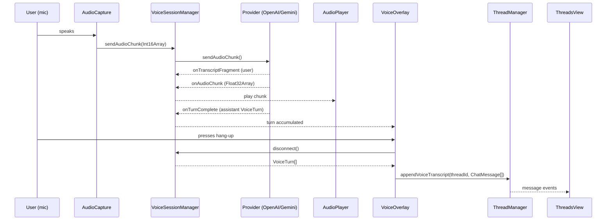

# Real-Time Voice Support — Feature Spec and Implementation Plan

**Plugin:** obsidian-claude-threads
**Date:** 2026-05-15
**Status:** Draft — pending decisions in Section 6 before implementation begins

---

## Table of Contents

1. Feature Spec
2. Architecture Design
3. ADR-001: Integration Model (overlay vs. thread type)
4. ADR-002: Transport Strategy (WebRTC vs. WebSocket)
5. ADR-003: Transcript Persistence
6. Open Questions (decisions needed before Phase 1)
7. Implementation Plan

---

## 1. Feature Spec

### 1.1 Problem Statement

The plugin today is text-only. A user who wants to think aloud, dictate a long prompt, or conduct a back-and-forth conversation with an AI in natural language has no path inside the plugin. They must context-switch to a separate app (ChatGPT voice, Gemini app, etc.), losing the thread context and vault integration they have here.

### 1.2 What We Are Building

Real-time bidirectional voice sessions with an AI. The user presses a button, speaks, hears a spoken response, and the conversation is transcribed into the existing thread message history.

Two AI voice providers are supported:

| Provider | Model | Transport |
|---|---|---|
| OpenAI | gpt-4o-realtime-preview | WebSocket (Phase 1); WebRTC optional in Phase 2 |
| Google Gemini | gemini-2.0-flash-live (or current live model) | WebSocket |

These are entirely separate AI backends from Claude. Voice sessions do not route through the Claude Agent SDK, Claude CLI, or any thread's existing session.

### 1.3 User-Facing Behavior

1. The user opens a thread (or creates one).
2. A microphone button appears in the input row, next to the send button.
3. Pressing the mic button opens a **voice overlay** attached to the current thread.
4. The overlay shows: connection status, a speaking/listening indicator, a live transcript area, and a hang-up button.
5. The user speaks. The AI responds in audio. Both sides of the conversation appear as transcript lines in the overlay in real time.
6. When the user ends the session (hang-up button, or Escape), all transcript turns are committed to the thread's `messages[]` as `ChatMessage` records — user turns as `role: 'user'`, AI turns as `role: 'assistant'`, with a `voiceSession: true` marker.
7. The voice overlay closes. The thread now shows the complete conversation in the normal text message list.

### 1.4 Scope

In scope:
- Voice overlay UI with provider selection
- `RealtimeVoiceProvider` abstraction with OpenAI and Gemini implementations
- WebSocket transport for both providers
- Transcript committed to thread message history on session end
- API key storage in plugin settings
- Microphone access via Electron's `getUserMedia`
- Audio output via `AudioContext` (Web Audio API)
- Provider and API key settings in the Settings tab

Out of scope (explicit non-goals):
- WebRTC transport for OpenAI (deferred, not currently needed)
- Voice-to-text transcription without a response (push-to-talk dictation only)
- Streaming Claude Code agent actions triggered by voice (voice is a separate backend)
- Saving audio recordings to disk
- Mobile Obsidian support (Electron-only feature)
- Multi-speaker or conference scenarios

### 1.5 Success Criteria

- A user can complete a full bidirectional voice conversation with either OpenAI or Gemini without leaving Obsidian.
- The transcript lands in the thread and is saved to the vault if vault persistence is enabled.
- Microphone permission is requested cleanly through Electron's existing permission flow.
- End-to-end latency (speak to first audio byte out) is under 1.5 seconds on a reasonable connection, which is within what both APIs offer.

---

## 2. Architecture Design

### 2.1 Component Map

```
src/
  voice/
    RealtimeVoiceProvider.ts      # Interface + shared types
    OpenAIRealtimeProvider.ts     # WebSocket impl for OpenAI Realtime API
    GeminiLiveProvider.ts         # WebSocket impl for Gemini Live API
    AudioCapture.ts               # getUserMedia + PCM encoding
    AudioPlayer.ts                # AudioContext-based streaming playback
    VoiceSessionManager.ts        # Lifecycle coordinator; one instance per active overlay
  VoiceOverlay.ts                 # Obsidian Modal subclass — the UI
  types.ts                        # +voiceSession flag on ChatMessage, +voice settings
  main.ts                         # +mic button wiring, +settings section
  styles.css                      # +voice overlay styles
```

### 2.2 `RealtimeVoiceProvider` Interface

This interface is the entire contract. Both providers implement it. `VoiceSessionManager` only speaks to this interface.

```typescript
// src/voice/RealtimeVoiceProvider.ts

export type VoiceProviderName = 'openai' | 'gemini';

export interface VoiceTurn {
  role: 'user' | 'assistant';
  text: string;
  timestampMs: number;
}

export interface VoiceProviderCallbacks {
  onConnected: () => void;
  onDisconnected: (reason?: string) => void;
  onError: (err: Error) => void;

  /** Partial transcript fragment as it arrives — used for live display */
  onTranscriptFragment: (role: 'user' | 'assistant', text: string) => void;

  /** A complete turn is finalized (user speech end, or assistant response end) */
  onTurnComplete: (turn: VoiceTurn) => void;

  /** Raw audio chunk to play — Float32Array of PCM samples, 24 kHz mono */
  onAudioChunk: (samples: Float32Array) => void;

  /** Provider wants to indicate the AI is currently speaking */
  onSpeakingStateChange: (speaking: boolean) => void;
}

export interface RealtimeVoiceProvider {
  readonly name: VoiceProviderName;

  /**
   * Establish the WebSocket connection and begin the session.
   * Resolves when the connection is confirmed ready for audio.
   */
  connect(callbacks: VoiceProviderCallbacks): Promise<void>;

  /**
   * Send a chunk of user audio to the provider.
   * @param pcm16 16-bit PCM samples, 24 kHz mono, little-endian
   */
  sendAudioChunk(pcm16: Int16Array): void;

  /**
   * Signal that the user has stopped speaking (for providers that need
   * an explicit end-of-speech event to trigger a response).
   */
  commitUserAudio(): void;

  /**
   * Interrupt the AI's current response (stop playback, allow user to speak).
   */
  interruptAssistant(): void;

  /** Cleanly close the session and WebSocket. */
  disconnect(): void;
}
```

Key design notes:

- Audio format is normalized at the interface boundary: 16-bit PCM in from `AudioCapture`, Float32 PCM out to `AudioPlayer`. Each provider implementation handles its own base64/binary encoding internally.
- `onTurnComplete` is the only event that creates `ChatMessage` records. Fragments are display-only.
- The interface says nothing about WebRTC vs. WebSocket — that is an implementation detail inside each provider.

### 2.3 `AudioCapture`

Wraps `navigator.mediaDevices.getUserMedia` in an Electron-compatible way. Resamples to 24 kHz mono using `AudioContext.createScriptProcessor` (or `AudioWorklet` — see Open Questions). Emits `Int16Array` chunks via a callback at roughly 100ms intervals.

Key constraint: Electron's renderer process has access to `getUserMedia` but requires the microphone permission to be granted at the OS level first. The plugin should catch `NotAllowedError` and surface a Notice with instructions.

### 2.4 `AudioPlayer`

Wraps `AudioContext` for streaming playback. Accepts `Float32Array` chunks and schedules them onto an `AudioBufferSourceNode` queue to produce continuous output. Handles buffer underrun gracefully (brief silence rather than click/pop).

### 2.5 `VoiceSessionManager`

Owns the lifecycle for a single voice session. Responsibilities:

- Instantiates the correct provider based on `activeProvider` setting
- Starts `AudioCapture`, pumps chunks to `provider.sendAudioChunk()`
- Passes `onAudioChunk` callbacks to `AudioPlayer`
- Accumulates completed turns in `turns: VoiceTurn[]`
- On `disconnect()`: converts `turns` into `ChatMessage[]` and returns them to the caller (`VoiceOverlay`) for insertion into the thread

`VoiceSessionManager` does not know anything about `Thread`, `ThreadManager`, or `ChatMessage`. It returns raw `VoiceTurn[]`. The overlay handles the translation.

### 2.6 `VoiceOverlay`

An Obsidian `Modal` subclass. It is opened against a specific `threadId`.

Structure:
```
.ct-voice-overlay
  .ct-voice-status          # "Connecting…" / "Listening" / "AI speaking"
  .ct-voice-waveform        # Animated bars (CSS only, no canvas required)
  .ct-voice-transcript      # Live scrolling transcript fragments
  .ct-voice-controls
    button.ct-voice-hangup  # "End call" / hang-up icon
    button.ct-voice-mute    # Toggle mic mute
```

On modal close (hang-up or Escape): calls `VoiceSessionManager.disconnect()`, receives `VoiceTurn[]`, converts to `ChatMessage[]`, inserts into the target thread via `ThreadManager.appendVoiceTranscript(threadId, messages)`, triggers `plugin.saveSettings()`.

### 2.7 Settings Additions

```typescript
// Additions to PluginSettings in types.ts

voiceProvider: 'openai' | 'gemini';
openaiApiKey: string;     // stored in plugin data, not in vault
geminiApiKey: string;
voiceEnabled: boolean;    // master toggle — hides mic button if false
```

The API keys are stored in Obsidian's `plugin.saveData()` blob (same as all other settings). This is not encrypted, but it is stored in the user's local `.obsidian/plugins/` directory, consistent with how every other Obsidian plugin handles keys. A settings note should make this explicit.

### 2.8 ThreadManager Addition

One small addition to `ThreadManager`:

```typescript
appendVoiceTranscript(threadId: string, messages: ChatMessage[]): void
```

Pushes the messages array into `thread.messages`, updates `thread.updatedAt`, emits individual `{ type: 'message', message }` events for each, then emits `{ type: 'done' }`. This allows `ThreadsView` to render the transcript without any new event types.

### 2.9 Data Flow Diagram



---

## 3. ADR-001: Integration Model

**Date:** 2026-05-15
**Status:** Proposed

### Context

Voice interaction needs a UI surface. Three models were considered.

### Options Considered

| Option | Description | Pros | Cons |
|---|---|---|---|
| A. New thread type | Voice opens in a dedicated tab alongside text threads | Natural parallelism with existing tabs; voice history lives in its own thread | Requires new `Thread` variant type; complicates tab overflow logic; voice session and text session are then disconnected from each other |
| B. Mode within existing thread | A toggle in the input row switches the thread between text and voice mode | Context is shared — user can ask Claude a text question and follow up by voice in the same thread | Two very different backends (Claude Agent SDK vs. realtime voice API) operating against the same message list creates semantic confusion; "voice mode" still needs Claude Agent SDK for tool use, so it's not a pure voice backend |
| C. Overlay modal attached to current thread | Voice opens as a floating modal over the current thread; transcript commits to that thread on close | No new thread type; existing thread receives the transcript; minimal surface area for new code; matches how other Obsidian modals work (fork, permission) | Does not allow voice and text to run concurrently within the same thread; the overlay blocks the UI while active |

**Recommendation: Option C.**

The overlay model is smallest-viable. It does not require a new `Thread` variant, does not change the tab system, and the "block UI while active" constraint is fine — voice sessions are short and intentional. The fork modal sets a direct precedent for this pattern in the existing codebase.

### Consequences

Easier: Adding voice without restructuring `Thread` or `ThreadManager`; the transcript commit is a clean append.
Harder: Concurrent voice + text in the same thread is not possible.
We are betting that users want voice to be a deliberate mode shift, not a background-capable second channel.

### Risks

If users want to run voice in one thread while a Claude agent session runs in another (different thread), that works fine — the overlay is per-thread. If they want concurrent voice + Claude in the *same* thread, this design does not support it and would require revisiting.

---

## 4. ADR-002: Transport Strategy

**Date:** 2026-05-15
**Status:** Proposed

### Context

OpenAI Realtime API supports both WebRTC and WebSocket. Gemini Live is WebSocket only. Electron supports both natively.

### Options Considered

| Option | Pros | Cons |
|---|---|---|
| WebSocket for both providers | Single transport abstraction; simpler `AudioCapture` path (no ICE, no DTLS, no STUN); easier to debug; works today in Electron renderer | Slightly higher latency than WebRTC under ideal conditions (~50ms); requires manual VAD (voice activity detection) or silence detection for turn management |
| WebRTC for OpenAI, WebSocket for Gemini | Lowest possible latency for OpenAI; OpenAI's VAD is built into the WebRTC path; official "browser-native" recommended approach | Two distinct transport codepaths; `RTCPeerConnection` in Electron requires care with `app://` scheme and security origin; cannot be shared with Gemini; more complex to debug |
| WebRTC for both | Maximum performance | Gemini does not support WebRTC; impossible |

**Recommendation: WebSocket for both providers in Phase 1.**

The latency difference between WebSocket and WebRTC for this use case is imperceptible in practice (both providers target sub-1s end-to-end). The implementation complexity reduction is significant: one `AudioCapture` pipeline, no ICE negotiation, no STUN server configuration, no WebRTC-specific Electron permission issues.

WebRTC for OpenAI can be added in Phase 2 as a performance option if users request it.

### Consequences

Easier: Single audio pipeline; easier testing; no Electron WebRTC origin issues.
Harder: Must implement client-side silence detection for OpenAI turn commitment (server VAD is available via WebSocket mode too — this is not a blocker).
We are betting that WebSocket latency is sufficient for a good voice UX.

### Risks

OpenAI may deprecate or de-prioritize the WebSocket path in favor of WebRTC over time. Monitor their changelog. The `RealtimeVoiceProvider` interface is transport-agnostic, so a WebRTC implementation can be swapped in later without changing anything above the provider layer.

---

## 5. ADR-003: Transcript Persistence

**Date:** 2026-05-15
**Status:** Proposed

### Context

Voice sessions produce turn-by-turn transcripts. How and when do these become `ChatMessage` records?

### Options Considered

| Option | Description | Pros | Cons |
|---|---|---|---|
| A. Stream into thread live | Each completed turn appends to `thread.messages` immediately during the voice session | Thread is always up to date even if the overlay is force-closed | Requires `ThreadsView` to re-render while the voice overlay is open; could create visual noise; if session crashes mid-conversation, partial transcript is already committed |
| B. Commit all turns on session end | Turns accumulate in `VoiceSessionManager`; all are committed when the overlay closes | Clean batch commit; thread is consistent; no partial state; matches how the fork modal works | If Obsidian crashes during a voice session, the transcript is lost; no live preview in the thread during the call |
| C. Commit turns on session end with crash recovery | Same as B but periodically serialize `turns[]` to `localStorage` or a temp file; clear on commit | Crash safe; clean commit | More implementation complexity for a relatively rare failure mode |

**Recommendation: Option B for Phase 1.**

Session crash during a voice call is an edge case. Option B is clean and consistent with how other modals in the plugin work. Option C can be added later if user feedback indicates it is needed.

A `voiceSession: true` field on committed `ChatMessage` records allows future differentiation (e.g. filtering voice vs. text turns in the Agent Dashboard).

### Consequences

Easier: No threading between `VoiceOverlay` and `ThreadsView` during an active session.
Harder: Users lose transcript if Obsidian crashes mid-call.
We are betting that voice sessions are short enough that crash loss is not a meaningful risk.

---

## 6. Open Questions — Decisions Needed Before Implementation

The following items require Rick's input. None of them block the spec itself, but each blocks a specific phase of implementation.

**Q1. Provider preference — which goes first?**
OpenAI and Gemini have different key provisioning stories. OpenAI keys are widely held by developers; Gemini requires Google AI Studio. Which provider should Phase 1 implement first? Recommendation: OpenAI first (broader key availability among likely early users).

**Q2. API key storage — is plugin data acceptable?**
Keys are stored in Obsidian's `plugin.saveData()` alongside all other settings. This is a local file, not synced (unless the user has Obsidian Sync enabled, in which case the key travels with the vault). Is this acceptable, or do you want a separate storage path (e.g. macOS Keychain via Electron's `safeStorage`)?

**Q3. Voice activity detection (VAD) — server-side or client-side?**
Both OpenAI and Gemini support server-side VAD (the API decides when the user has finished speaking). Client-side VAD (silence detection in `AudioCapture`) is an alternative. Server-side VAD is simpler to implement and usually better performing. Recommendation: use server-side VAD for both providers. Any objection?

**Q4. Audio output device selection**
Should the voice overlay expose an output device selector (e.g. headphones vs. speakers)? Or default to the system default audio output? Recommendation: default device only for Phase 1, add selector if requested.

**Q5. Concurrent voice and Claude sessions**
Under the proposed design, the mic button is available even when a Claude Agent session is running on that thread. Do you want to prevent opening a voice overlay while a Claude session is active on the same thread (to avoid confusing the user), or allow them concurrently? Recommendation: prevent concurrency, show an error if attempted.

---

## 7. Implementation Plan

Ordered by phase. Each phase is independently shippable.

### Phase 1: Skeleton and OpenAI provider

Goal: one working end-to-end voice session with OpenAI, transcript committed to thread.

**Step 1.1 — Types and settings** (`src/types.ts`, `src/main.ts`)
- Add `voiceEnabled`, `voiceProvider`, `openaiApiKey`, `geminiApiKey` to `PluginSettings` and `DEFAULT_SETTINGS`
- Add `voiceSession?: true` field to `ChatMessage`
- Add a "Voice" section to `ClaudeThreadsSettingTab.display()` with: master toggle, provider dropdown, and two API key text inputs (one visible per selected provider)

**Step 1.2 — AudioCapture** (`src/voice/AudioCapture.ts`)
- `getUserMedia({ audio: true })` wrapped in a class
- Resample to 24 kHz mono using `AudioContext` + `ScriptProcessorNode`
- Emit `Int16Array` chunks via callback
- Handle `NotAllowedError` with a user-facing Notice
- Expose `start()`, `stop()`, `mute()`, `unmute()` methods

**Step 1.3 — AudioPlayer** (`src/voice/AudioPlayer.ts`)
- `AudioContext`-based streaming playback queue
- `enqueue(samples: Float32Array): void` schedules buffer with 50ms lookahead
- `stop(): void` cancels pending buffers
- Handle underrun with silence fill to avoid clicks

**Step 1.4 — RealtimeVoiceProvider interface** (`src/voice/RealtimeVoiceProvider.ts`)
- Define the interface and `VoiceTurn`, `VoiceProviderCallbacks` types exactly as specified in Section 2.2

**Step 1.5 — OpenAI provider** (`src/voice/OpenAIRealtimeProvider.ts`)
- WebSocket connection to `wss://api.openai.com/v1/realtime?model=gpt-4o-realtime-preview`
- Auth via `Authorization: Bearer <key>` and `OpenAI-Beta: realtime=v1` header
- On connect: send `session.update` event to configure input/output audio format (pcm16, 24 kHz), enable server VAD, set voice
- `sendAudioChunk`: encode `Int16Array` to base64, send `input_audio_buffer.append` event
- `commitUserAudio`: send `input_audio_buffer.commit` (only needed if server VAD is disabled; with server VAD this is a no-op)
- Handle inbound events: `response.audio.delta` (decode base64 to Float32, call `onAudioChunk`), `response.audio_transcript.delta` (call `onTranscriptFragment`), `response.audio_transcript.done` and `conversation.item.input_audio_transcription.completed` (call `onTurnComplete`), `error` (call `onError`)
- `interruptAssistant`: send `response.cancel`
- `disconnect`: close WebSocket

**Step 1.6 — VoiceSessionManager** (`src/voice/VoiceSessionManager.ts`)
- Constructor takes `providerFactory: () => RealtimeVoiceProvider`
- `start(callbacks)`: instantiates provider, `AudioCapture`, `AudioPlayer`; wires them together
- `stop()`: calls `provider.disconnect()`, `AudioCapture.stop()`, `AudioPlayer.stop()`; returns `VoiceTurn[]`
- Internal `turns: VoiceTurn[]` accumulates via `onTurnComplete`

**Step 1.7 — VoiceOverlay** (`src/VoiceOverlay.ts`)
- `Modal` subclass; constructor takes `app`, `plugin`, `threadId`
- `onOpen()`: builds overlay DOM, starts `VoiceSessionManager`, updates status indicator
- Hang-up button / `onClose()`: calls `manager.stop()`, translates `VoiceTurn[]` to `ChatMessage[]`, calls `ThreadManager.appendVoiceTranscript()`
- Live transcript: `onTranscriptFragment` updates a scrolling `.ct-voice-transcript` div
- State machine: `connecting` > `listening` > `speaking` > `disconnected` — drives status label and waveform animation class

**Step 1.8 — ThreadManager addition** (`src/ThreadManager.ts`)
- Add `appendVoiceTranscript(threadId: string, messages: ChatMessage[]): void`
- Push messages, update `updatedAt`, emit `{ type: 'message' }` per message, emit `{ type: 'done' }`

**Step 1.9 — Mic button in ThreadsView** (`src/ThreadsView.ts`)
- Add `private voiceBtn: HTMLButtonElement` initialized in `buildUI()`
- Insert it in `.ct-input-actions` between stop button and more button: `[↵] [■] [mic] […]`
- Button is hidden when `voiceEnabled` is false
- Click handler: if `manager.isRunning(activeThreadId)`, show Notice "Stop the current session before starting a voice call"; else open `new VoiceOverlay(this.app, this.plugin, this.activeThreadId)`
- Use `setIcon(voiceBtn, 'mic')` (Lucide icon present in Obsidian)

**Step 1.10 — CSS** (`styles.css`)
- `.ct-voice-overlay` modal styles
- `.ct-voice-status` label
- `.ct-voice-waveform` with keyframe animation for the "listening" bars
- `.ct-voice-transcript` scrollable transcript area with user/assistant turn styling
- `.ct-voice-controls` button row

**Step 1.11 — Integration test**
- Manual test checklist: connect, speak, receive audio, hang up, verify transcript in thread, verify vault save if enabled

---

### Phase 2: Gemini provider

Goal: add the second provider so users can switch in settings.

**Step 2.1 — GeminiLiveProvider** (`src/voice/GeminiLiveProvider.ts`)
- WebSocket to Gemini Live API endpoint
- Auth via `?key=<apiKey>` query parameter (or `x-goog-api-key` header — confirm against current Gemini docs at implementation time)
- On connect: send `BidiGenerateContentSetup` message with model and audio config
- `sendAudioChunk`: send `BidiGenerateContentRealtimeInput` with inline audio data
- Handle inbound: `BidiGenerateContentServerContent` for audio chunks and transcript, `toolCall` events (ignore for Phase 1 voice), `GoAway` for graceful shutdown
- `interruptAssistant`: send a new `BidiGenerateContentRealtimeInput` with `activityEnd` or equivalent (confirm against API at implementation time — this API is still evolving)
- Map Gemini's event model to the shared `VoiceProviderCallbacks` contract

**Step 2.2 — Provider factory** (`src/voice/RealtimeVoiceProvider.ts` or new `VoiceProviderFactory.ts`)
- `createProvider(settings: PluginSettings): RealtimeVoiceProvider`
- Selects `OpenAIRealtimeProvider` or `GeminiLiveProvider` based on `settings.voiceProvider`
- Passes the appropriate API key

**Step 2.3 — Update VoiceOverlay**
- `VoiceOverlay` constructor switches from hardcoded OpenAI to `createProvider(plugin.settings)`
- Show provider name in the overlay status area

---

### Phase 3: Polish and edge cases

Goal: production quality.

**Step 3.1 — Connection error recovery**
- In `OpenAIRealtimeProvider` and `GeminiLiveProvider`: implement exponential backoff reconnect (max 3 attempts) on unexpected WebSocket close
- Notify overlay via `onDisconnected` with reason string so user can see what happened

**Step 3.2 — Mute/unmute**
- Wire `ct-voice-mute` button in overlay to `AudioCapture.mute()` / `unmute()`
- When muted, stop sending chunks to provider; show visual indicator

**Step 3.3 — Keyboard shortcut**
- Register a command `open-voice-session` with a hotkey (suggested: none by default; user-assignable)
- Opens voice overlay on the active thread

**Step 3.4 — Agent Dashboard voice indicator**
- In `AgentDashboard`, threads that contain `voiceSession: true` messages show a mic icon badge alongside the message count

**Step 3.5 — Vault save integration**
- When `saveThreadsToVault` is true, the committed voice transcript is saved to the vault note by the existing `VaultPersistence` path (no new code needed — `appendVoiceTranscript` emits standard `message` events which trigger the existing save path in `ThreadsView.handleEvent`)

---

### File Change Summary

| File | Change type | Phase |
|---|---|---|
| `src/types.ts` | Modify: add voice settings fields, `voiceSession` on ChatMessage | 1 |
| `src/main.ts` | Modify: voice settings section in SettingTab | 1 |
| `src/ThreadManager.ts` | Modify: add `appendVoiceTranscript` | 1 |
| `src/ThreadsView.ts` | Modify: add mic button, VoiceOverlay open logic | 1 |
| `src/VoiceOverlay.ts` | New file | 1 |
| `src/voice/RealtimeVoiceProvider.ts` | New file | 1 |
| `src/voice/OpenAIRealtimeProvider.ts` | New file | 1 |
| `src/voice/AudioCapture.ts` | New file | 1 |
| `src/voice/AudioPlayer.ts` | New file | 1 |
| `src/voice/VoiceSessionManager.ts` | New file | 1 |
| `styles.css` | Modify: add voice overlay styles | 1 |
| `src/voice/GeminiLiveProvider.ts` | New file | 2 |
| `src/voice/VoiceProviderFactory.ts` | New file | 2 |

No changes to `ClaudeSession.ts`, `InProcessSummarizer.ts`, `AgentDashboard.ts`, `VaultPersistence.ts`, or `ObsidianTools.ts` are required in Phases 1 or 2.

---

### Dependencies to Add

```json
// No runtime npm packages required.
// Both WebSocket (built into Electron/Chromium) and Web Audio API are native.
// No additional devDependencies needed for Phase 1 or 2.
```

Both the OpenAI Realtime API and Gemini Live API are accessed over raw WebSocket. No official client SDK is required or recommended for a streaming WebSocket integration in an Electron plugin. Using the raw WebSocket keeps the bundle small and eliminates SDK version churn risk.

---

*End of spec. Resolve the open questions in Section 6, then begin with Step 1.1.*
